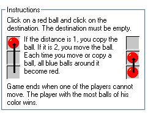
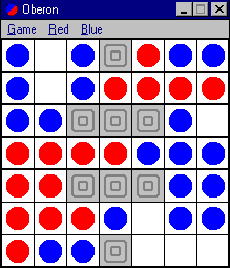

# Assegnazione Progetto

## ATAXX

### Regole e parametri:

- Queste regole e parametri sono stati stabiliti da me stesso nel mese di aprile e luglio 1997, dopo aver studiato i giochi Ataxx esistenti.

1. **Gli elementi essenziali**
   - Il gioco si svolge su una scacchiera quadrata, divisa in quadrati della stessa dimensione.
   - Due giocatori si confrontano, utilizzando pedine di colori diversi (un colore per giocatore).
   - Ogni giocatore inizia con due pedine, le 4 pedine sono agli angoli del quadrato.
   - Utilizzando mosse orizzontali, verticali e diagonali, ogni pedina può spostarsi in un quadrato libero adiacente, dividendosi in due pedine, oppure può saltare una casella per andare in un quadrato libero (senza dividere).
   - Ogni pedina avversaria adiacente al quadrato di destinazione cambia colore (in direzione orizzontale, verticale e diagonale, fino a quando 8 pedine possono essere toccate).
   - I giocatori si alternano, facendo una mossa per turno.
   - Non è possibile "passare" o saltare un turno, a meno che non si sia intrappolati.
   - Il vincitore è quello con più pedine quando tutti i quadrati sono riempiti. 

2. **Gli elementi standard**
   - Le dimensioni della scacchiera sono 7x7.
   - Il colore della scacchiera è nero.
   - I colori delle pedine sono bianco e nero.
   - L'umano gioca contro un altro umano.
   - Ogni giocatore inizia con 2 pedine, diametralmente opposte.
   - Il giocatore 2 ha le pedine nere, in alto a destra e in basso a sinistra. Il giocatore 1 ha le pedine bianche(in alto a sinistra e in basso a destra), e gioca per primo.
   - L'utente prima dell'inizio della partita può decidere se bloccare o no delle caselle che saranno bloccate per tutto il gioco e quindi la pedina non potrà andarci sopra.

3. **Gli elementi meno usuali**
   - Confronto umano-computer non  è possibile.
   - Possibilità di scegliere (modificare) la posizione dei blocchi.
   - Non è possibile scegliere il colore delle pedine iniziali.
   - Indicazione dei quadrati di destinazione per la pedina indicata.
   - Possibilità di annullare.

4. **Elementi complementari**
   - Il numero di blocchi deve essere limitato, per mantenere il gioco "giocabile". La seguente regola può essere presa in considerazione: il numero di blocchi deve essere inferiore a 9(in particolare, non ci sono blocchi negli 4 angoli).
   - Le configurazioni dei blocchi sono conformi alla codifica dei blocchi-configurazioni.
   
   