# REPORT
## Indice Gruppo Brooks
   1. [Introduzione](#1-introduzione)
   2. [Modello di dominio](#2-modello-di-dominio)
   3. [Requisiti specifici](#3-requisiti-specifici)
      - [3.1 Requisiti funzionali](#31-requisiti-funzionali)
      - [3.2 Requisiti non funzionali](#32-requisiti-non-funzionali)
   4. [System Design](#4-system-design)
      - [4.1 Diagramma dei package](#41-diagramma-dei-package)
      - [4.2 Architettura dell'applicazione](#42-architettura-dellapplicazione)
      - [4.3 Commenti sulle decisioni prese](#43-commento-sulle-decisioni-prese)
   5. [OO Design](#5-oo-design)
      - [5.1 Diagramma delle classi](#51-diagramma-delle-classi)
      - [5.2 Diagrammi di sequenza](#52-diagramma-di-sequenza)
      - [5.3 Principio di OO Design](#53-principi-di-oo-design)
      - [5.4 Controlli relativi al OO design](#54-controlli-relativi-al-oo-design)
      - [5.5 Commenti sulle decisioni prese](#55-commento-sulle-decisioni-prese)
   6. [Riepilogo del test](#6-riepilogo-del-test)
      - [6.1 Strumenti di analisi/testing del codice utilizzati](#61-strumenti-di-analisitesting-del-codice-utilizzati)
      - [6.2 Presentazione esiti test e considerazioni](#62-presentazione-esiti-test-e-considerazioni)
      - [6.3 Descrizione dei test effettuati](#63-descrizione-dei-test-effettuati)
   7. [Manuale utente](#7-manuale-utente)
      - [7.1 Passi Preliminari](#71-passi-preliminari)
         - [7.1.1 Installazione e configurazione di Docker](#711-installazione-e-configurazione-di-docker)
         - [7.1.2 Autenticazione con GitGub](#712-autenticazione-con-github)
      - [7.2 Avvio dell'applicazione](#72-avvio-dellapplicazione)
         - [7.2.1 Guida ai comandi](#721-guida-ai-comandi)
         - [7.2.2 Come si gioca](#722-come-si-gioca)
         - [7.2.3 Glossario e termini chiave](#723-glossario-e-termini-chiave)
   8. [Processo di sviluppo e organizzazione del lavoro](#8-processo-di-sviluppo-e-organizzazione-del-lavoro)
      - [8.1 Introduzione Processo di Sviluppo](#81-introduzione-processo-di-sviluppo)
      - [8.2 RoadMap degli Sprint](#82-roadmap-degli-sprint)
      - [8.3 Gestione degli Sprint ](#83-gestione-degli-sprint)
          - [8.3.1  Sprint 0](#831-sprint-0)
          - [8.3.2 Sprint 1](#832-sprint-1)
          - [8.3.3 Sprint 2](#833-sprint-2)
      - [8.4 Software Utilizzati](#84-software-utilizzati)
      - [8.5 Comunicazione interna al Team](#85-comunicazione-interna-al-team)
   9. [Analisi retrospettiva](#9-analisi-retrospettiva)
      - [9.1 Sprint 0](#91-sprint-0)
      - [9.2 Sprint 1](#92-sprint-1)


## 1. INTRODUZIONE

Questo documento fornisce una panoramica generale del progetto Ataxx svolto dal gruppo Brooks, evidenziando l'importanza del lavoro di squadra e gli obiettivi fissati per lo Sprint 2.
Vengono presentati il modello di dominio, i requisiti specifici, il design del sistema e dell'architettura object-oriented, il riepilogo dei test, il manuale utente e l'analisi retrospettiva degli sprint precedenti.

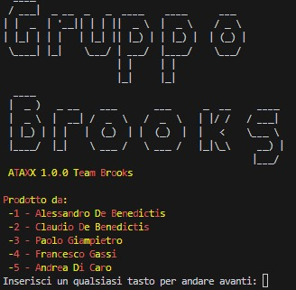


## 2. MODELLO DI DOMINIO

Il modello di dominio del sistema è cruciale per comprendere le interazioni tra le diverse entità coinvolte nel gioco di Ataxx come i giocatori, le pedine, il tavoliere e le regole del gioco.
Un'analisi approfondita di queste entità e delle relazioni che intercorrono consente di ottenere una visione completa del funzionamento del gioco.
In seguito è presente il grafico UML del nostro progetto Ataxx.
Tutti i diagrammi riportati nel codice sono stati realizzati con [*StarUML*](https://staruml.io/)

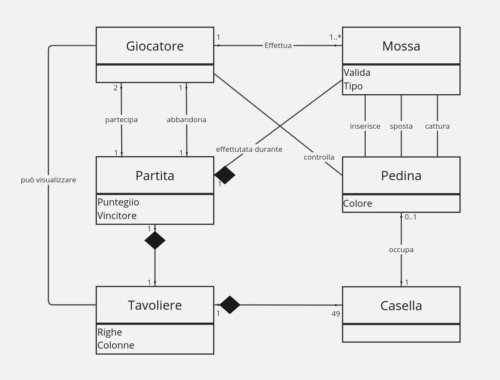


## 3. REQUISITI SPECIFICI

I requisiti specifici del sistema sono suddivisi in requisiti funzionali e non funzionali, ognuno
dei quali contribuisce a definire le caratteristiche e le prestazioni dell'applicazione.

   ### 3.1 REQUISITI FUNZIONALI

   #### INDICE USER STORY Sprint 1 e Sprint 2:
   Le seguenti user story inizierebbero con Come Giocatore voglio ...
   - [Come Giocatore voglio ... iniziare una nuova partita #01](#user-story-1-come-giocatore-voglio--iniziare-una-nuova-partita-01) 
   - [Come Giocatore voglio ... mostrare l'help con elenco comandi #02](#user-story-2-come-giocatore-voglio--mostrare-lhelp-con-elenco-comandi-02)
   - [Come Giocatore voglio ... mostrare il tavoliere vuoto con la numerazione #03](#user-story-3-come-giocatore-voglio--mostrare-il-tavoliere-vuoto-con-la-numerazione-03)
   - [Come Giocatore voglio ... mostrare il tavoliere con le pedine e la numerazione #04](#user-story-4-come-giocatore-voglio--mostrare-il-tavoliere-con-le-pedine-e-la-numerazione-04)
   - [Come Giocatore voglio ... visualizzare le mosse possibili di una pedina #05](#user-story-5-come-giocatore-voglio--visualizzare-le-mosse-possibili-di-una-pedina-05)
   - [Come Giocatore voglio ... abbandonare la partita #06](#user-story-6-come-giocatore-voglio--abbandonare-la-partita-06)
   - [Come Giocatore voglio ... chiudere il gioco #07](#user-story-7-come-giocatore-voglio--chiudere-il-gioco-07)
   - [Come Giocatore voglio ... giocare una nuova pedina in una casella adiacente a una propria pedina #08](#user-story-8-come-giocatore-voglio--giocare-una-nuova-pedina-in-una-casella-adiacente-a-una-propria-pedina-08)
   - [Come Giocatore voglio ... spostare una propria pedina saltando una casella adiacente #09](#user-story-9-come-giocatore-voglio--spostare-una-propria-pedina-saltando-una-casella-adiacente-09)
   - [Come Giocatore voglio ... catturare una pedina avversaria come effetto di una mossa #10](#user-story-10-come-giocatore-voglio--catturare-una-pedina-avversaria-come-effetto-di-una-mossa-10)
   - [Come Giocatore voglio ... mostrare le mosse giocate #11](#user-story-11-come-giocatore-voglio--mostrare-le-mosse-giocate-11)
   - [Come Giocatore voglio ... passare il turno per impossibilità di movimento #12](#user-story-12-come-giocatore-voglio--passare-il-turno-per-impossibilità-di-movimento-12)
   - [Come Giocatore voglio ... visualizzare il fine partita con il vincitore e i punti segnati #13](#user-story-13-come-giocatore-voglio--visualizzare-il-fine-partita-con-il-vincitore-e-i-punti-segnati-13)
   - [Come Giocatore voglio ... mostrare il tempo di gioco #14](#user-story-14-come-giocatore-voglio--mostrare-il-tempo-di-gioco-14)
   - [Come Giocatore voglio ... impostare caselle non accessibili #15](#user-story-15-come-giocatore-voglio--impostare-caselle-non-accessibili-15)

   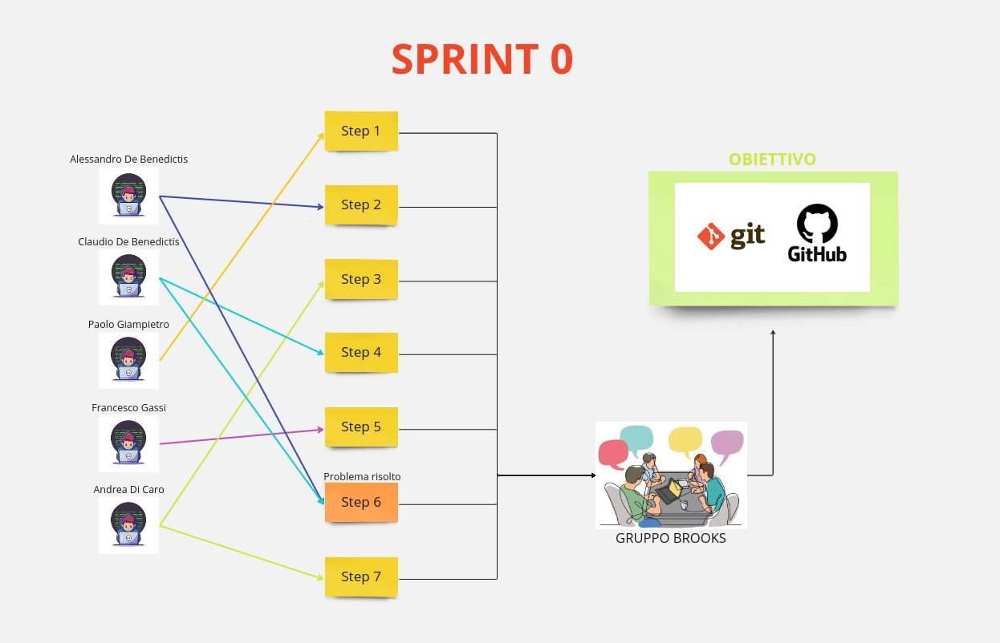
   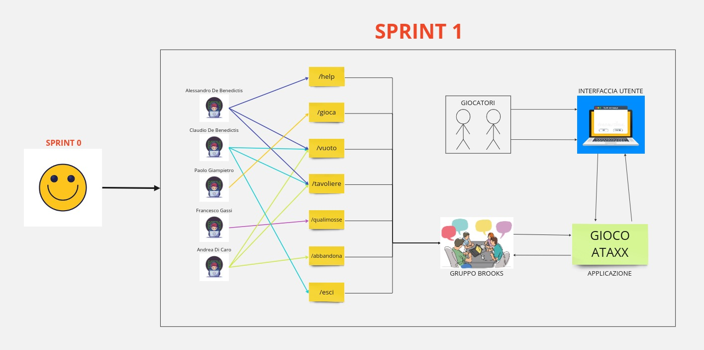
   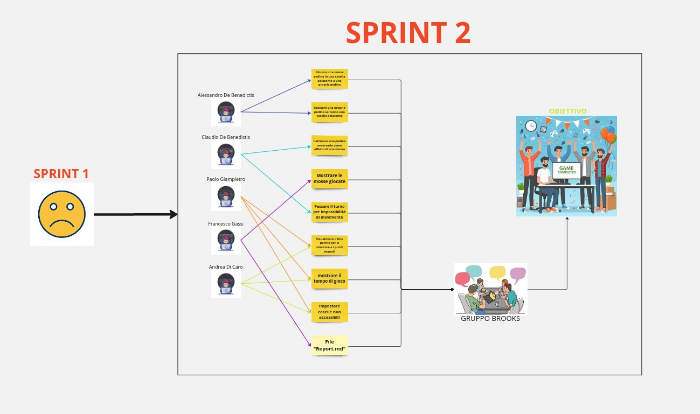


   ### User Story 1: Come Giocatore voglio ... iniziare una nuova partita #01
   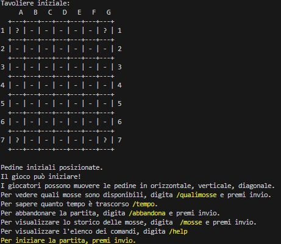
   - **DESCRIZIONE:** In questo screen viene mostrato il momento in cui il giocatore inserisce il comando "/gioca" nel menu principale del gioco Ataxx.
   - **CASI D'USO:**
      - **Attori:** Giocatore
      - **Obiettivo:** Consentire al giocatore di avviare una nuova partita.
      - **Pre-condizioni:** Il gioco e' avviato e il giocatore si trova nel menu principale.
      - **Post-condizioni:** Il giocatore puo' avviare una nuova partita dal menu principale.
      - **Scenario base:**
         1. Il giocatore inserisce il comando "/gioca".
         2. Il gioco avvia una nuova partita e visualizza il tavoliere.
   - **ESTENSIONI:** Se il giocatore non preme il pulsante "/gioca", il gioco rimane nel menu principale senza avviare una nuova partita.
   - **OUTPUT FINALE**
   Dopo aver premuto il pulsante "/gioca", il gioco avvia una nuova partita e visualizza il tavoliere pieno.

--------------------------------------------------------------------------------------------------------

   ### User Story 2: Come Giocatore voglio ... mostrare l'help con elenco comandi #02
   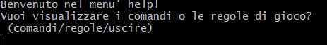
   - **DESCRIZIONE:**  In questo screen viene mostrato il momento in cui il giocatore inserisce il comando "Help" nel menu principale del gioco Ataxx.
   - **CASI D'USO:**
      - **Attori:** Giocatore
      - **Obiettivo:** Consentire al giocatore di accedere all'help con l'elenco dei comandi dal menù principale.
      - **Pre-condizioni:** Il gioco è avviato e il giocatore si trova nel menu principale.
      - **Post-condizioni:** Il giocatore può accede all'help per comprendere i comandi disponibili durante il gioco.
      - **Scenario base:**
         1. Il giocatore inserisce il comando "Help".
         2. Il gioco visualizza una finestra o una schermata con l'elenco dei comandi e le relative descrizioni.
   - **ESTENSIONI:** Se il giocatore non preme il pulsante "Help", il gioco rimane nel menu principale senza mostrare l'help.
   - **OUTPUT FINALE:**
   Dopo aver inserito il comando /Help, il gioco fa visualizzare l'elenco dei comandi e le relative descrizioni. Il giocatore può accedere all'help per comprendere i comandi disponibili durante il gioco.

--------------------------------------------------------------------------------------------------------

   ### User Story 3: Come Giocatore voglio ... mostrare il tavoliere vuoto con la numerazione #03
   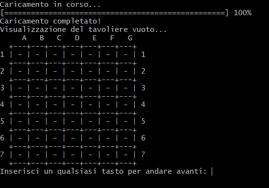
   - **DESCRIZIONE:**   Viene mostrato il momento in cui il giocatore inserisce il comando "/vuoto" nel menu principale del gioco Ataxx. Qui viene visualizzato il tavoliere vuoto con la numerazione delle caselle, pronto per iniziare una nuova partita.
   - **CASI D'USO:**
      - **Attori:** Giocatore
      - **Obiettivo:** Mostrare al giocatore il tavoliere vuoto con la numerazione delle caselle.
      - **Pre-condizioni:** Il gioco è avviato e il giocatore si trova nel menu principale.
      - **Post-condizioni:** Il giocatore può vedere il tavoliere vuoto e numerato per facilitare la comprensione delle mosse.
      - **Scenario base:**
         1. Il gioco visualizza il tavoliere vuoto con la numerazione delle caselle.
   - **ESTENSIONI:** Se il giocatore inserisce il comando "/vuoto" e la partita non è in corso, si suggerisce al giocatore di iniziare la partita con "/gioca".
   - **OUTPUT FINALE:**
   Durante una nuova partita, il gioco visualizza il tavoliere vuoto con la numerazione delle caselle. Il giocatore può vedere il tavoliere vuoto e numerato per facilitare la comprensione delle mosse.

--------------------------------------------------------------------------------------------------------

   ### User Story 4: Come Giocatore voglio ... mostrare il tavoliere con le pedine e la numerazione #04
   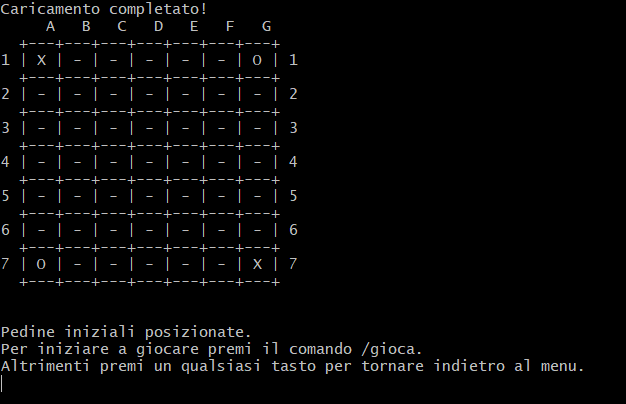
   - **DESCRIZIONE:**  In questo screen viene mostrato il momento in cui il giocatore inserisce il comando "/tavoliere" nel menu principale del gioco Ataxx. Qui viene visualizzato il tavoliere con le pedine e la numerazione delle caselle, pronto per iniziare a giocare.
   - **CASI D'USO:**
      - Attori: Giocatore
      - Obiettivo: Mostrare al giocatore il tavoliere con le pedine posizionate e la numerazione delle caselle.
      - Pre-condizioni: Il gioco è in corso.
      - Post-condizioni: Il giocatore può vedere il tavoliere completo con le pedine posizionate e la numerazione delle caselle.
      - Scenario base:
         1. Il gioco visualizza il tavoliere con le pedine posizionate e la numerazione delle caselle.
   - **OUTPUT FINALE:**
   Durante una partita in corso, il gioco visualizza il tavoliere con le pedine posizionate e la numerazione delle caselle. Il giocatore può vedere il tavoliere completo con le pedine posizionate e la numerazione delle caselle.

--------------------------------------------------------------------------------------------------------

   ### User Story 5: Come Giocatore voglio ... visualizzare le mosse possibili di una pedina #05
   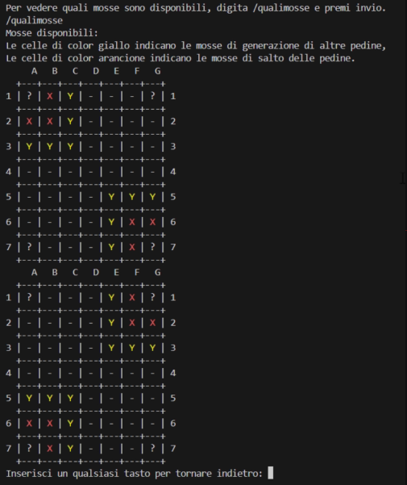
   - **DESCRIZIONE:** Viene mostrato il risultato del comando "/qualimosse" nel gioco Ataxx.  Qui viene visualizzato il tavoliere con una pedina selezionata e le caselle disponibili sulle quali effettuare le mosse evidenziate con un colore diverso.
   - **CASI D'USO:**
      - Attori: Giocatore
      - Obiettivo: Mostrare al giocatore le mosse possibili di una pedina selezionata.
      - Pre-condizioni: Il gioco è in corso e il giocatore ha selezionato una pedina.
      - Post-condizioni: Il giocatore può vedere le mosse possibili della pedina selezionata.
      - Scenario base:
         1. Il giocatore seleziona una delle proprie pedine.
         2. Il gioco identifica le caselle in cui la pedina può muoversi.
   - **ESTENSIONI:** Se il giocatore seleziona una pedina che non può muoversi, il gioco mostra un messaggio di errore indicando che non ci sono mosse disponibili per quella pedina.
   - **OUTPUT FINALE:**
   Dopo aver selezionato una pedina durante una partita in corso, il gioco identifica le caselle in cui la pedina può muoversi. Il giocatore può vedere le mosse possibili della pedina selezionata.

--------------------------------------------------------------------------------------------------------

   ### User Story 6: Come Giocatore voglio ... abbandonare la partita #06
   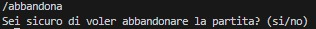
   - **DESCRIZIONE:**  Viene mostrato il momento in cui il giocatore inserisce il comando "/abbandona" con conseguente conferma.
   - **CASI D'USO:**
      - **Attori:** Giocatore
      - **Obiettivo:** Consentire al giocatore di abbandonare una partita in corso.
      - **Pre-condizioni:** La partita è in corso.
      - **Post-condizioni:** Il giocatore può abbandonare una partita in corso in un qualsiasi momento.
      - **Scenario base:**
         1. Il giocatore inserisce il comando "/abbandona".
         2. Il gioco chiede conferma e, se confermato, termina la partita e riporta il giocatore al menu principale.
   - **ESTENSIONI:** Se il giocatore decide di annullare l'azione di abbandono della partita dopo aver inserito il comando "/abbandona", il gioco continua normalmente la partita senza termina

   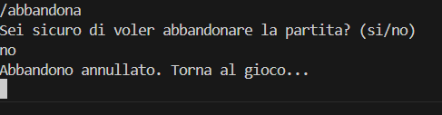
   
   - **OUTPUT FINALE:**
   Dopo aver inserito il comando "/abbandona" durante una partita in corso e confermato l'azione, il gioco termina la partita e riporta il giocatore al menu principale. Il giocatore può abbandonare una partita in corso in qualsiasi momento.

--------------------------------------------------------------------------------------------------------

   ### User Story 7: Come Giocatore voglio ... chiudere il gioco #07
   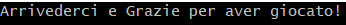
   - **DESCRIZIONE:** Viene mostrato il momento in cui il giocatore inserisce il comando "/esci" nel menu principale. Qui il gioco si chiude completamente.
   - **CASI D'USO:**
      - **Attori:** Giocatore
      - **Obiettivo:** Consentire al giocatore di chiudere completamente il gioco.
      - **Pre-condizioni:** Il gioco è avviato e il giocatore si trova nel menu principale.
      - **Post-condizioni:** Il giocatore può chiudere il gioco dal menu principale.
      - **Scenario base:**
         1. Il giocatore inserisce il comando "/esci".
         2. Il gioco si chiude completamente.
   - **ESTENSIONI:**  Se il giocatore inserisce il comando "/chiudi" per errore e non desidera realmente chiudere il gioco, potrebbe essere aggiunta un'opzione per annullare l'azione di chiusura con un messaggio di conferma.
   - **OUTPUT FINALE:**
   Dopo aver inserito il comando "/chiudi" nel menu principale del gioco, il gioco si chiude completamente.

--------------------------------------------------------------------------------------------------------

   ### User Story 8: Come Giocatore voglio ... giocare una nuova pedina in una casella adiacente a una propria pedina #08
   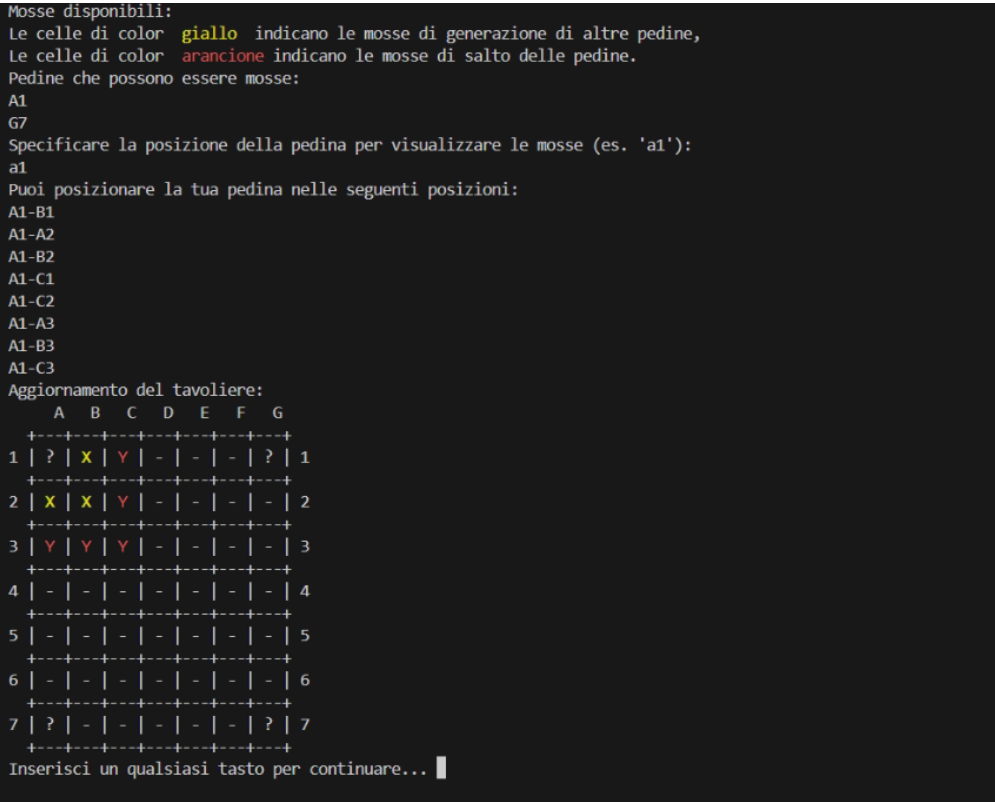
   - **DESCRIZIONE:**  A partita in corso di gioco, l'applicazione deve accettare che il giocatore di turno giochi sul tavoliere una nuova pedina (bianca o nera) in una casella adiacente (in senso ortogonale e diagonale)
   - **CASI D'USO:**
      - **Attori:** Giocatore
      - **Obiettivo:** Inserire una nuova pedina in una casella adiacente a una propria pedina
      - **Pre-condizioni:** 
         1. Il gioco è in corso
         2. È il turno del giocatore
      - **Post-condizioni:** La nuova pedina viene posizionata nella casella adiacente
      - **Scenario base:**
         1. Il giocatore seleziona una propria pedina esistente.
         2. Il giocatore sceglie una casella adiacente (ortogonalmente o diagonalmente) vuota.
         3. La nuova pedina viene posizionata nella casella selezionata.
         4. La mossa viene registrata utilizzando la notazione algebrica.
         5. Il turno passa all'altro giocatore.
   - **ESTENSIONI:** Se la casella scelta non è adiacente o è occupata, viene mostrato un messaggio di errore.
   - **OUTPUT FINALE**
      La nuova pedina viene visualizzata nella casella selezionata sul tavoliere.

--------------------------------------------------------------------------------------------------------

   ### User Story 9: Come Giocatore voglio ... spostare una propria pedina saltando una casella adiacente #09
   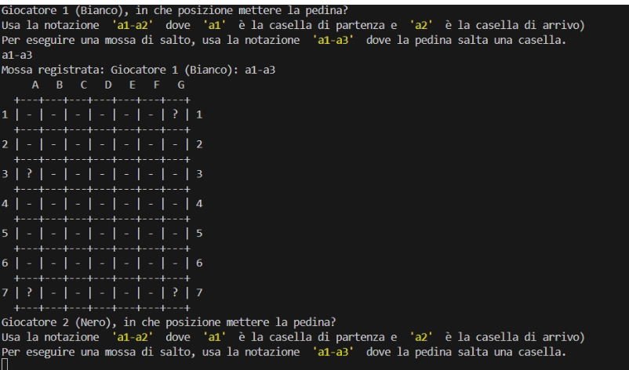
   - **DESCRIZIONE:** A partita in corso di gioco, l'app deve accettare che il giocatore di turno sposti sul tavoliere una propria pedina (bianca o nera) con il salto di una casella adiacente, utilizzando una notazione algebrica 
   - **CASI D'USO:**
      - **Attori:** Giocatore
      - **Obiettivo:** Spostare una propria pedina oltre una casella adiacente
      - **Pre-condizioni:**
         1. Il gioco è in corso
         2. È il turno del giocatore
      - **Post-condizioni:** La pedina si sposta nella nuova casella
      - **Scenario base:**
         1. Il giocatore seleziona una propria pedina
         2. Il giocatore indica la casella in cui vuole spostare la pedina, saltando una casella adiacente
         3. Si verifica che la casella di arrivo sia libera e non adiacente alla casella di partenza
         4. Si verifica che la casella saltata possa essere occupata da qualsiasi pedina
         5. Il turno passa all'altro giocatore
   - **ESTENSIONI:** Se la casella di arrivo non è adiacente o è occupata, viene mostrato un messaggio di errore.
   - **OUTPUT FINALE:**
      La pedina appare nella nuova casella e il tavoliere viene aggiornato

--------------------------------------------------------------------------------------------------------

   ### User Story 10: Come Giocatore voglio ... catturare una pedina avversaria come effetto di una mossa #10
   - **DESCRIZIONE:** Se al termine di una mossa, che può essere una mossa di espansione o uno spostamento di una pedina nel gioco, vi sono pedine avversarie adiacenti alla casella di arrivo.
   - **CASI D'USO:**
      - **Attori:** Giocatore
      - **Obiettivo:** Catturare pedine avversarie adiacenti
      - **Pre-condizioni:**
         1. Il gioco è in corso
         2. È il turno del giocatore
      - **Post-condizioni:**
         1. Le pedine avversarie adiacenti alla casella di arrivo vengono catturate e cambiano colore
         2. Il turno passa all'altro giocatore
      - **Scenario base:**
         1. Il giocatore effettua una mossa (espansione o salto)
         2. Si verificano le caselle adiacenti alla nuova posizione della pedina
         3. Si cambia colore alle pedine avversarie adiacenti alla nuova posizione
         4. Il turno passa all'altro giocatore
   - **ESTENSIONI:** Se la mossa è una mossa di espansione, tutte le pedine avversarie adiacenti alla casella di arrivo vengono catturate e cambiano di colore, passando sotto il controllo del giocatore che ha effettuato la mossa.
   - **OUTPUT FINALE:**
   Le pedine avversarie catturate cambiano colore e il tavoliere viene aggiornato.

--------------------------------------------------------------------------------------------------------

   ### User Story 11: Come Giocatore voglio ... mostrare le mosse giocate #11
   
   - **DESCRIZIONE:** Quando l'utente invia il comando /mosse, l'applicazione deve mostrare la storia completa delle mosse effettuate fino a quel momento.
   - **CASI D'USO:**
      - **Attori:** Giocatore
      - **Obiettivo:** Visualizzare la storia delle mosse
      - **Pre-condizioni:** È in corso una partita
      - **Post-condizioni:** Mostrare la lista delle mosse effettuate
      - **Scenario base:**
         1. Il giocatore inserisce il comando "/mosse"
         2. L'app mostra la storia delle mosse in notazione algebrica
   - **ESTENSIONI:** 
   - **OUTPUT FINALE:**
   L'app visualizza la lista delle mosse giocate fino a quel momento

--------------------------------------------------------------------------------------------------------

   ### User Story 12: Come Giocatore voglio ... passare il turno per impossibilità di movimento #12
   - **DESCRIZIONE:** Se il giocatore non può muovere nessuna pedina del proprio colore, l’app avvisa che il turno passa all’altro colore
   - **CASI D'USO:**
      - **Attori:** Giocatore
      - **Obiettivo:** Passare il turno in caso di impossibilità di movimento
      - **Pre-condizioni:**
         1. È il turno del giocatore
         2. Il giocatore non può muovere nessuna pedina
      - **Post-condizioni:** Il turno passa all'altro giocatore
      - **Scenario base:**
         1. Il giocatore tenta di muovere una pedina ma si accorge che non può fare nessuna mossa valida
         2. L'app verifica l'impossibilità di movimento
         3. L'app avvisa che il turno passa all'altro giocatore
         4. Il turno passa all'altro giocatore
   - **ESTENSIONI:**
   - **OUTPUT FINALE:**
   Viene mostrato un messaggio di notifica

      --------------------------------------------------------------------------------------------------------

   ### User Story 13: Come Giocatore voglio ... visualizzare il fine partita con il vincitore e i punti segnati #13
   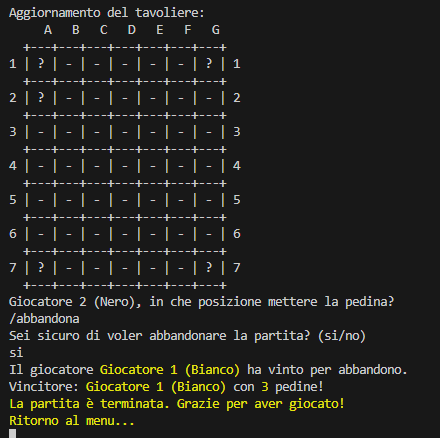
   - **DESCRIZIONE:** Se tutte le caselle del tavoliere sono riempite e nessuna pedina può essere mossa l'applicazione deve rilevare questa condizione mostrare il vincitore e con quale punteggio ha vinto.
   - **CASI D'USO:**
      - **Attori:** Giocatore
      - **Obiettivo:** Visualizzare il vincitore e i punti
      - **Pre-condizioni:** Nessuna pedina può essere mossa perché tutte le caselle del tavoliere sono state riempite
      - **Post-condizioni:** Si dichiara il vincitore e si mostrano i punti
      - **Scenario base:**
         1. Tutte le caselle del tavoliere sono riempite
         2. L'app conta le pedine di ciascun colore
         3. L'app dichiara il vincitore (colui con il maggior numero di pedine)
         4. L'app mostra il punteggio di ciascun giocatore
   - **ESTENSIONI:** L'applicazione deve contare il numero di pedine bianche e nere presenti sul tavoliere.
   - **OUTPUT FINALE:**
   Viene mostrato un messaggio di notifica

--------------------------------------------------------------------------------------------------------

   ### User Story 14: Come Giocatore voglio ... mostrare il tempo di gioco #14
   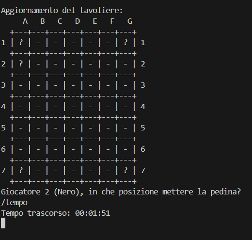
   - **DESCRIZIONE:** Quando l'utente invia il comando /tempo, l'app risponde con il tempo trascorso dall'inizio della partita, nel formato ore:minuti:secondi.
   - **CASI D'USO:**
      - **Attori:** Giocatore
      - **Obiettivo:** Visualizzare il tempo di gioco
      - **Pre-condizioni:** La partita è in corso o terminata
      - **Post-condizioni:** L'app mostra il tempo di gioco trascorso
      - **Scenario base:**
         1. Il giocatore inserisce il comando "/tempo"
         2. L'app calcola il tempo trascorso dall'inizio della partita
         3. L'app mostra il tempo nel formato ore:minuti:secondi
   - **ESTENSIONI:** 
   - **OUTPUT FINALE:**
   Viene mostrato un messaggio di notifica

--------------------------------------------------------------------------------------------------------
   ### User Story 15: Come Giocatore voglio ... impostare caselle non accessibili #15

   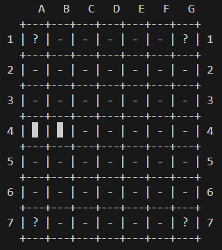
   - **DESCRIZIONE:** La casella xn specificata non sarà accessibile per le pedine. La casella xn verrà mostrata sul tavoliere con uno sfondo grigio.
   - **CASI D'USO:**
      - **Attori:** Giocatore
      - **Obiettivo:** Bloccare caselle del tavoliere
      - **Pre-condizioni:** La partita non è in corso
      - **Post-condizioni:** Le caselle bloccate vengono mostrate con uno sfondo grigio
      - **Scenario base:**
         1. Il giocatore inserisce il comando "/blocca xn" con le coordinate della casella da bloccare
         2. L'app verifica che le caselle da bloccare non siano caselle di partenza o caselle adiacenti a quelle di partenza
         3. L'app verifica che non siano state bloccate più di 9 caselle
         4. L'app blocca le caselle e aggiorna il tavoliere
   - **ESTENSIONI:** 
      1. Se il comando tenta di bloccare una casella di partenza, l'app mostra un messaggio di errore
      2. Se il comando tenta di bloccare una casella adiacente a una casella di partenza, l'app mostra un messaggio di errore
      3. Se il comando tenta di bloccare più di 9 caselle, l'app mostra un messaggio di errore
   - **OUTPUT FINALE:**
   Le caselle bloccate sono mostrate con uno sfondo grigio e non possono essere utilizzate per le mosse. Viene mostrato messaggio di conferma

   ### 3.2 REQUISITI NON FUNZIONALI
   Il funzionamento del software richiede:
   - **RFN1**: il container Docker dell'app deve essere eseguito da terminali che supportano Unicode con encoding UTF-8 o UTF-16
   - **Elenco terminali supportati**: 
      - **Linux** :
         * Terminal
      - **Windows**:
         * Powershell
         * Gitbash 

## 4. SYSTEM DESIGN
   
   ### 4.1 Diagramma dei package:
   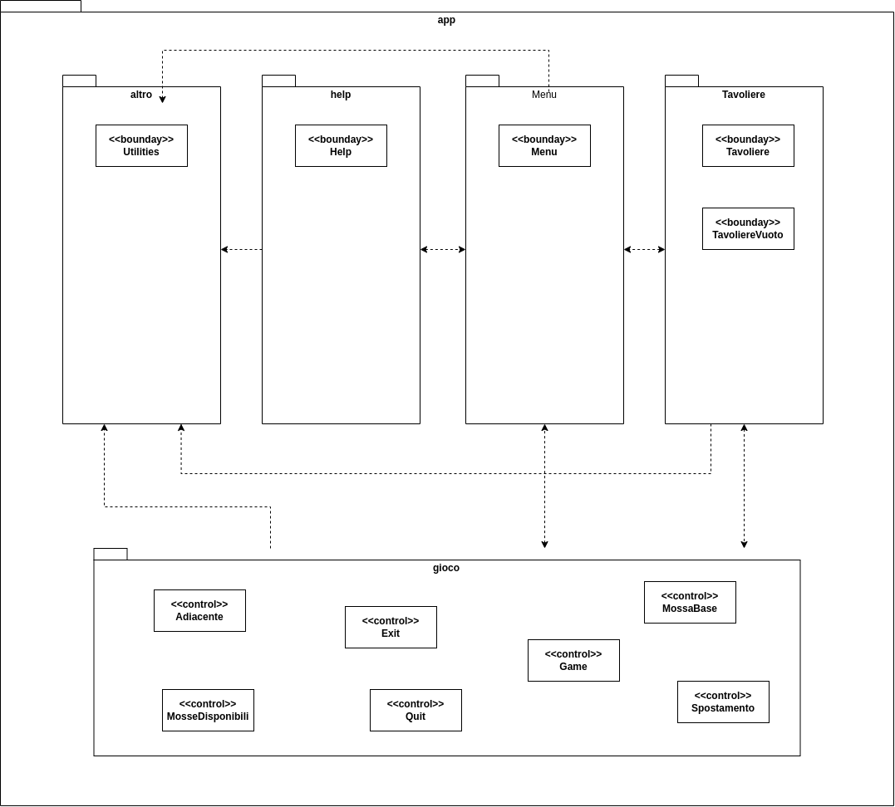

   
   ### 4.2 Architettura dell'applicazione
   Per la suddivisione in package è stato utilizzato il pattern architetturale dell'Entity Control Boundary (ECB) che prevede la classificazione delle classi in tre categorie:

•  **CONTROL:** sono le classi che si occupano della logica del software. In particolare si occupano di gestire le interazioni tra le entità e di gestire le richieste dell'utente.

•	**BOUNDARY:** sono le classi che si occupano di interfacciarsi con l'utente e di gestire le logiche di presentazione. In particolare si occupano di ricevere i comandi dell'utente e di mostrare i risultati delle operazioni.

•	**ENTITY:** sono le classi che rappresentano le entità del dominio del problema. In particolare si occupano di rappresentare le entità del gioco e di gestire le loro interazioni.

Passiamo ora all'elenco dei package e delle classi in essi contenuti:

•	Il package app contiene la classe App che si occupa dell'inizializzazione e avvio del software.
•	Il package app contiene tutti i package e le classi create dal team di sviluppo:

   - Altro 

   - Gioco

   - Help

   - Menu

   - Tavoliere

•	Il package **Altro** contiene la classe Utilities, classe Boundary, dove ci sono tutte le funzioni di utilità
•	Il package **Gioco** contiene: 

   - **Adiacente**, classe **Control:** classe che gestisce la logica delle mosse adiacenti, cioè la duplicazione delle pedine nelle caselle adiacenti a quelle di partenza. Verifica la validità delle mosse, aggiorna lo stato del tavoliere e notifica eventuali errori.

   - **Exit,** classe **Control:** classe che si occupa di gestire l'uscita del gioco

   - **Game,** classe **Control:** classe che gestisce l'intero ciclo di vita di una partita, dall'inizializzazione del tavoliere alla gestione del turno dei giocatori, fino alla determinazione del vincitore. Gestisce gli input dell'utente, aggiorna lo stato del gioco, visualizza il tavoliere e il tempo trascorso, e mantiene un log delle mosse. Inoltre, offre diverse opzioni di comando per i giocatori, come vedere le mosse disponibili, visualizzare il tempo trascorso, abbandonare la partita e visualizzare lo storico delle mosse.

   -	**MosseBase**, classe **Control:** classe che gestisce le dinamiche di cattura delle pedine nel gioco.

   -	**MosseDisponibili,** classe **Control:** classe che gestisce il calcolo e la visualizzazione delle mosse    
   disponibili per una pedina selezionata.

   -	**Quit,** classe **Control:** classe che si occupa dell'abbandono della partita da parte di un giocatore e di visualizzare il vincitore.

   -	**Spostamento,**  classe **Control:** classe che gestisce la logica delle mosse adiacenti, cioè la duplicazione delle pedine nelle caselle adiacenti a quelle di partenza.

•	Il package **Help** contiene:
   -	**Help,** classe **Boundary:** classe che permette di visualizzare i comandi e le regole di gioco. Viene utilizzata per mostrare all'utente le informazioni necessarie per giocare.

•	Il package **Menù** contiene:
   -	**Menù**, classe **Boundary**: classe che fornisce un'interfaccia testuale che permette agli utenti di accedere alle diverse funzionalità del gioco, come avviare una nuova partita, ottenere aiuto, visualizzare il tavoliere, bloccare una casella, e terminare il programma.

•	Il package Tavoliere contiene:

   - **Tavoliere**, classe **Entity:** classe che gestisce la logica di base di un tavoliere di gioco, inclusa l'inizializzazione, la stampa, e la gestione delle pedine e delle caselle.

   - **TavoliereVuoto,** classe **Boundary:** classe che visualizza un tavoliere vuoto con etichette per righe e colonne.


   ### 4.3 Commento sulle decisioni prese:
   È stata presa in considerazione l'utilizzo del pattern ECB. Questo metodo è stato scelto per la  sua capacità di separare le classi in base alla propria responsabilità per la sua abilità nel rispettare i principi della progettazione orientata agli oggetti, e per la sua capacità di migliorare la manutenibilità e la testabilità del codice grazie alla modularità dei componenti.

## 5. OO DESIGN

   ### 5.1 Diagramma delle classi:

Di segutio è riportato il diagramma delle classi relativo alla [User story 1](#user-story-1-come-giocatore-voglio--iniziare-una-nuova-partita-01)


   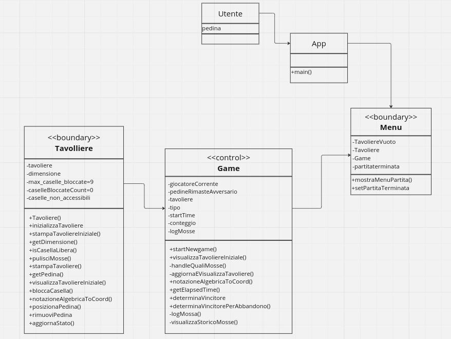


Di segutio è riportato il diagramma delle classi relativo alla [User story 6](#user-story-6-come-giocatore-voglio--abbandonare-la-partita-06)

   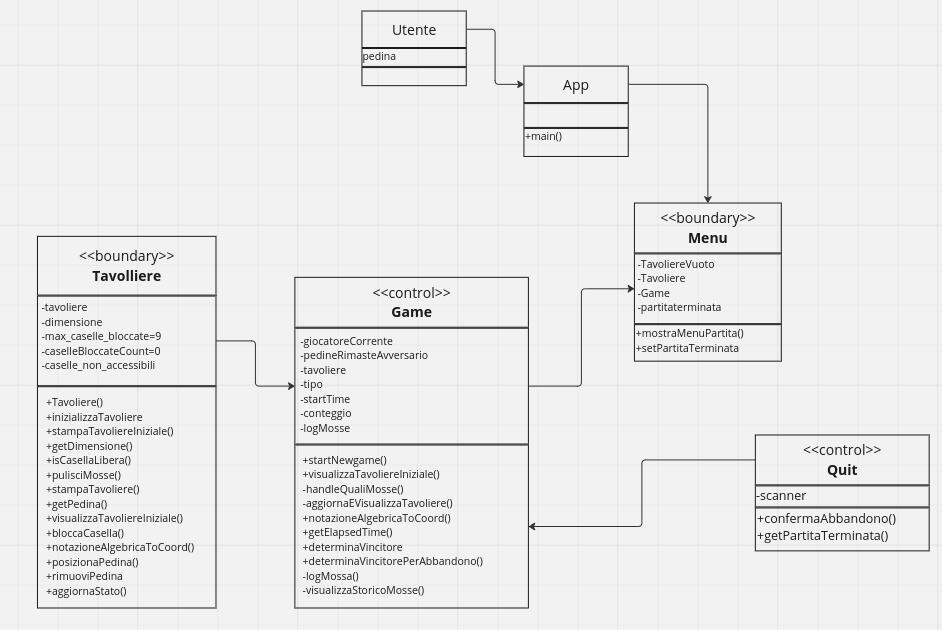

Di segutio è riportato il diagramma delle classi relativo alla [User story 13](#user-story-13-come-giocatore-voglio--visualizzare-il-fine-partita-con-il-vincitore-e-i-punti-segnati-13)

   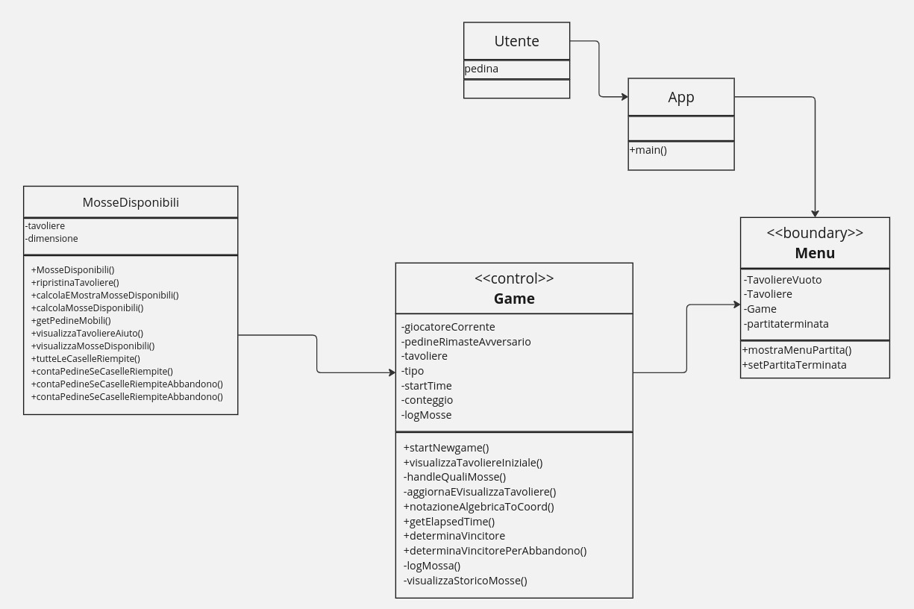

   ### 5.2 Diagramma di sequenza:

Di segutio è riportato il diagramma di sequenza relativo alla [User story 1](#user-story-1-come-giocatore-voglio--iniziare-una-nuova-partita-01)

   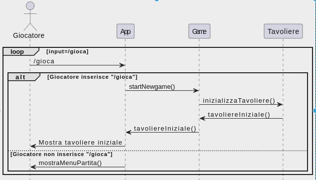

Di segutio è riportato il diagramma di sequenza relativo alla [User story 6](#user-story-6-come-giocatore-voglio--abbandonare-la-partita-06)

   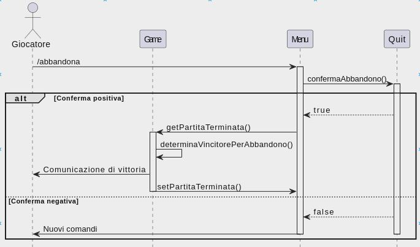

Di seguito è riportato il diagramma di sequenza relativo alla [User story 13](#user-story-13-come-giocatore-voglio--visualizzare-il-fine-partita-con-il-vincitore-e-i-punti-segnati-13)

 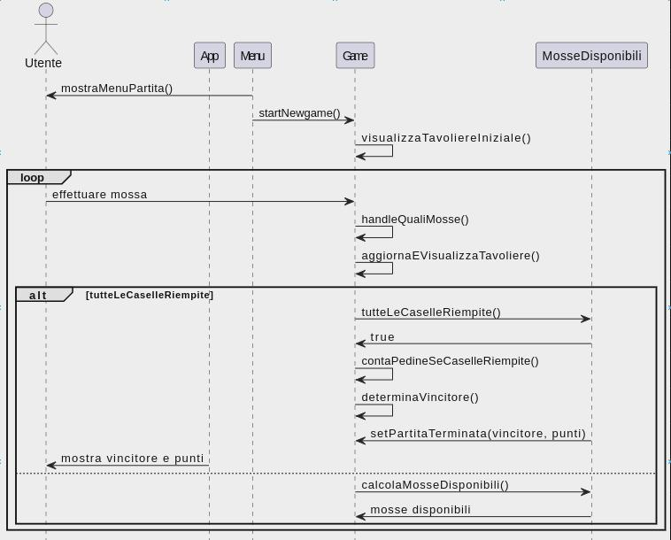


   ### 5.3 Principi di OO Design
   - **Information Hiding:** Isolare i dettagli interni di ogni componente del sistema per ridurre
     l'interdipendenza tra i componenti e facilitare la manutenzione.
   - **Alta Coesione:** Un componente con alta coesione si occupa di una singola funzione o entità,
     aumentando la chiarezza e la riutilizzabilità.
   - **Basso Accoppiamento:** Componenti poco accoppiati hanno meno dipendenze l'uno dall'altro, il
     che riduce gli impatti delle modifiche.
   - **Separazione della Presentazione:** Mantenere la logica di presentazione separata dalla logica di
     business per migliorare la manutenibilità e la testabilità.
   - **DRY (Don't Repeat Yourself):** Evitare la duplicazione di codice, usando astrazioni o funzioni per
     incapsulare comportamenti comuni.
   - **Principi SOLS:** Guida alla creazione di software facilmente estensibile e modificabile, includendo
     principi come Single Responsibility e Open/Closed.

   ### 5.4 Controlli relativi al OO design

   La separazione della presentazione è un principio di design che raccomanda di mantenere separata la logica di presentazione (UI) dalla logica di business. Tuttavia, ci sono situazioni e contesti specifici in cui seguire rigorosamente questo principio può non essere pratico o vantaggioso. Di seguito sono fornite le giustificazioni per ogni classe menzionata.

   ### 1. Tavoliere

- **Motivazioni:**

**Alta coesione:** La classe **Tavoliere** è responsabile di mantenere lo stato del gioco e fornire metodi per manipolare il tavoliere, come posizionare e rimuovere pedine. Separare la logica di presentazione in una classe diversa può frammentare la coesione, rendendo più difficile mantenere il codice.

**Semplicità:** La logica di presentazione per il tavoliere è relativamente semplice e strettamente legata al suo stato interno. Mantenere la presentazione all'interno della stessa classe rende il codice più leggibile e più facile da capire per gli sviluppatori che lavorano sulla logica del tavoliere.

### 2. TavoliereVuoto

- **Motivazioni:**

**Funzionalità specifica:** La classe **TavoliereVuoto** ha una funzione molto specifica: visualizzare un tavoliere vuoto. Separare la logica di presentazione in questo contesto aggiungerebbe complessità senza un chiaro vantaggio, data la natura semplice e autonoma di questa funzionalità.

**Utilizzo limitato:** Questa classe è utilizzata principalmente per visualizzare un tavoliere vuoto come introduzione o aiuto visivo per l'utente. La presentazione è parte integrante della sua funzione e separarla potrebbe non apportare significativi benefici in termini di manutenibilità.

### 3. MossaBase

- **Motivazioni**

**Logica di base: MossaBase** contiene logica comune di base per catturare pedine adiacenti. La presentazione dei risultati (come la cattura delle pedine) è direttamente legata alle operazioni di gioco. Separarla in un’altra classe potrebbe complicare la gestione degli eventi e la loro rappresentazione visiva.

**Utilizzo da classi** derivate: Dato che **MossaBase** è una classe base utilizzata da **Adiacente e Spostamento**, è logico mantenere una coerenza nel modo in cui la logica di cattura e presentazione viene implementata. Questo garantisce che le classi derivate possano utilizzare e estendere questa logica senza dover gestire complessità aggiuntive di comunicazione con una classe di presentazione separata.

### 4. Adiacente

- **Motivazioni**

**Responsabilità combinata:** La classe **Adiacente** gestisce sia la validazione che l'esecuzione delle mosse adiacenti. Parte della responsabilità dell’esecuzione delle mosse include la necessità di aggiornare e visualizzare il nuovo stato del tavoliere. Separare la presentazione in un’altra classe potrebbe introdurre interdipendenze non necessarie e aumentare il rischio di incoerenze tra lo stato del gioco e la sua rappresentazione.

**Interazione diretta con l'utente:** La classe deve fornire feedback immediato all'utente riguardo alla validità e al risultato delle mosse. Mantenere la logica di presentazione all’interno della classe consente di gestire più facilmente queste interazioni dirette.


### Classi effettivamente modificate: 
-	Spostamento.java
-	Adiacente.java
-	Menu.java
-	Quit.java
-	MosseDisponibili.java
-  Help.java

--------------------------------------------------------------------------------------------------------

## Controlli relativi al design orientato agli oggetti applicati alla classe Game:

### 1. Information Hiding

- **Controllo**: Verificare che i dettagli interni della classe siano nascosti e non accessibili direttamente dall'esterno.

- **Stato: OK.** Tutti gli attributi della classe Game sono dichiarati come private, garantendo l'incapsulamento dei dettagli interni.

### 2. Alta Coesione

-	**Controllo:** Verificare che ogni componente della classe Game si occupi di una singola funzione o entità.

-	**Stato: OK.** La classe Game si occupa della gestione del flusso del gioco e dell'interazione tra le componenti. Tuttavia, alcuni metodi sembrano fare più di una singola funzione (ad esempio, startNewGame), suggerendo una possibile rifattorizzazione per migliorare la coesione.

### 3. Basso Accoppiamento

-	**Controllo:** Verificare che la classe Game abbia poche dipendenze dirette da altre classi.

-	**Stato: OK.** Le dipendenze principali sono le classi Tavoliere, Adiacente, Spostamento, MosseDisponibili, Utilities, Menu, e Quit. La maggior parte delle interazioni avviene tramite metodi pubblici, riducendo l'accoppiamento.

### 4. Separazione della Presentazione

- **Controllo:** Verificare che la logica di presentazione sia separata dalla logica di business.

- **Stato: OK.** La classe Game contiene sia la logica di business che alcuni elementi di presentazione (es. System.out.println). 

### 5. DRY (Don't Repeat Yourself)

- **Controllo:** Verificare l'assenza di duplicazioni di codice.

- **Stato: OK.** Non sono evidenti duplicazioni significative di codice. Il metodo logMossa centralizza la registrazione delle mosse, evitando duplicazioni.

### 6. Principi SOLID

- **Single Responsibility Principle (SRP):** Ogni classe dovrebbe avere una sola responsabilità.

   - **Stato: OK .**  La classe Game gestisce diverse responsabilità, tra cui il flusso del gioco, la gestione delle mosse, e l'interfaccia utente.

- **Open/Closed Principle (OCP):** Le classi dovrebbero essere aperte all'estensione ma chiuse alla modifica.

   -  **Stato: OK.** La struttura della classe permette estensioni, come l'aggiunta di nuovi tipi di mosse, senza modificare la logica esistente.

--------------------------------------------------------------------------------------------------------

## Controlli relativi al design orientato agli oggetti applicati alla classe MossaBase:

### 1. Information Hiding

- **Controllo:**  Verificare che i dettagli interni della classe siano nascosti e non accessibili direttamente dall'esterno.

- **Stato:** OK. Gli attributi e metodi della classe MossaBase sono incapsulati correttamente.

### 2. Alta Coesione

- **Controllo:** Verificare che ogni componente della classe MossaBase si occupi di una singola funzione o entità.

- **Stato: OK.**  La classe MossaBase si occupa della gestione delle mosse di base e della cattura delle pedine adiacenti, mantenendo alta coesione.

### 3. Basso Accoppiamento

- **Controllo:** Verificare che la classe MossaBase abbia poche dipendenze dirette da altre classi.

- **Stato: OK.** La classe MossaBase dipende solo dalla classe Tavoliere, il che è appropriato per la sua funzionalità.

### 4. Separazione della Presentazione

- **Controllo:**  Verificare che la logica di presentazione sia separata dalla logica di business.

- **Stato: PARZIALE.**  La classe MossaBase include metodi che gestiscono la presentazione (notifyPedinaConvertita). Sarebbe opportuno separare questa logica in una classe di presentazione.

### 5. DRY (Don't Repeat Yourself)

- **Controllo:** Verificare l'assenza di duplicazioni di codice.

- **Stato: OK.**  Non ci sono duplicazioni di codice evidenti nella classe MossaBase.

### 6. Principi SOLID
- **Single Responsibility Principle (SRP):**  Ogni classe dovrebbe avere una sola responsabilità.

- **Stato: PARZIALE.**  La classe MossaBase dovrebbe gestire solo la logica delle mosse di base e la cattura delle pedine, mentre la notifica della conversione dovrebbe essere gestita da un'altra classe.

 - **Open/Closed Principle (OCP):**  Le classi dovrebbero essere aperte all'estensione ma chiuse alla modifica.

- **Stato: OK.** La classe permette estensioni senza modificare la logica esistente.

- **Suggerimenti di Miglioramento** Separazione della Logica di Presentazione: Abbiamo provveduto a spostare il metodo notifyPedinaConvertita in una classe separata responsabile della presentazione.

--------------------------------------------------------------------------------------------------------

## Controlli relativi al design orientato agli oggetti applicati alla classe MosseDisponibili:

### 1. Information Hiding:

- **Controllo:**  Verificare che i dettagli interni della classe siano nascosti e non accessibili direttamente dall'esterno.

- **Stato: OK.**  Gli attributi della classe MosseDisponibili sono incapsulati correttamente e non accessibili direttamente dall'esterno.

### 2. Alta Coesione

- **Controllo:**  Verificare che ogni componente della classe MosseDisponibili si occupi di una singola funzione o entità.

- **Stato: OK.**  La classe MosseDisponibili si occupa del calcolo e della visualizzazione delle mosse disponibili, mantenendo alta coesione.

### 3. Basso Accoppiamento

- **Controllo:** Verificare che la classe MosseDisponibili abbia poche dipendenze dirette da altre classi.

- **Stato: OK.** La classe MosseDisponibili dipende solo dalla classe Tavoliere, il che è appropriato per la sua funzionalità.

### 4. Separazione della Presentazione

- **Controllo:** Verificare che la logica di presentazione sia separata dalla logica di business.

- **Stato: PARZIALE.**  La classe MosseDisponibili include metodi che gestiscono la presentazione (visualizzaTavoliereAiuto, visualizzaMosseDisponibili). Sarebbe opportuno separare questa logica in una classe di presentazione.

### 5. DRY (Don't Repeat Yourself)

- **Controllo:** Verificare l'assenza di duplicazioni di codice.

**Stato: PARZIALE.** I metodi calcolaEMostraMosseDisponibili e calcolaMosseDisponibili contengono logica duplicata per il calcolo delle mosse disponibili. Sarebbe opportuno unificarli.

### 6. Principi SOLID

- **Single Responsibility Principle (SRP):** Ogni classe dovrebbe avere una sola responsabilità.

- **Stato: PARZIALE.** La classe MosseDisponibili dovrebbe gestire solo la logica delle mosse disponibili, mentre la presentazione delle mosse dovrebbe essere gestita da un'altra classe.
 - **Open/Closed Principle (OCP):** Le classi dovrebbero essere aperte all'estensione ma chiuse alla modifica.
- **Stato: OK.**  La classe permette estensioni senza modificare la logica esistente.
- **Suggerimenti di Miglioramento**
Separazione della Logica di Presentazione: Abbiamo provveduto a spostare i metodi di presentazione in una classe separata responsabile della presentazione.

--------------------------------------------------------------------------------------------------------

## Controlli relativi al design orientato agli oggetti applicati alla classe Quit:

### 1. Information Hiding

- **Controllo:**  Verificare che i dettagli interni della classe siano nascosti e non accessibili direttamente dall'esterno.

- **Stato: OK.**  Tutti gli attributi della classe Quit sono dichiarati come private e i metodi statici sono utilizzati per gestire le funzionalità.

### 2. Alta Coesione

- **Controllo:** Verificare che ogni componente della classe Quit si occupi di una singola funzione o entità.

- **Stato: OK.** La classe Quit si occupa esclusivamente della gestione dell'abbandono della partita.

### 3. Basso Accoppiamento

- **Controllo:** Verificare che la classe Quit abbia poche dipendenze dirette da altre classi.

- **Stato: OK.** La classe Quit dipende principalmente dalle classi Utilities e Menu per alcune funzionalità.

### 4. Separazione della Presentazione

- **Controllo:** Verificare che la logica di presentazione sia separata dalla logica di business.

- **Stato: OK.** La classe Quit include logica di presentazione nei metodi confermaAbbandono e getPartitaTerminata.

###  5. DRY (Don't Repeat Yourself)

- **Controllo:** Verificare l'assenza di duplicazioni di codice.

- **Stato: OK.** Non ci sono evidenti duplicazioni di codice nella classe Quit.

### 6. Principi SOLID

- **Single Responsibility Principle (SRP):** Ogni classe dovrebbe avere una sola responsabilità.

 **-Stato: OK.** La classe Quit gestisce la logica di abbandono della partita.

- **Open/Closed Principle (OCP):** Le classi dovrebbero essere aperte all'estensione ma chiuse alla modifica.

 -**Stato: OK.** La struttura della classe permette estensioni senza modificare la logica esistente.

--------------------------------------------------------------------------------------------------------

## Controlli relativi al design orientato agli oggetti applicati alla classe Adiacente:

### 1. Information Hiding

-	**Controllo:** Verificare che i dettagli interni della classe siano nascosti e non accessibili direttamente dall'esterno.

- **Stato: OK.** Gli attributi della classe Adiacente sono dichiarati come private, garantendo l'incapsulamento dei dettagli interni.

### 2. Alta Coesione

- **Controllo:** Verificare che ogni componente della classe Adiacente si occupi di una singola funzione o entità.

-	**Stato: OK.** La classe Adiacente si occupa della gestione delle mosse adiacenti, garantendo alta coesione.

### 3. Basso Accoppiamento

-	**Controllo:** Verificare che la classe Adiacente abbia poche dipendenze dirette da altre classi.

-	**Stato: OK.** La classe Adiacente dipende principalmente dalla classe Tavoliere, mantenendo il basso accoppiamento.

### 4. Separazione della Presentazione

-	**Controllo:** Verificare che la logica di presentazione sia separata dalla logica di business.

-	**Stato: OK.** La classe Adiacente include logica di presentazione nel metodo logMossa con le stampe System.
out.println.

### 5. DRY (Don't Repeat Yourself)

-	**Controllo:** Verificare l'assenza di duplicazioni di codice.

-	**Stato: OK.** Non ci sono evidenti duplicazioni di codice nella classe Adiacente.

### 6. Principi SOLID

-	**Single Responsibility Principle (SRP):** Ogni classe dovrebbe avere una sola responsabilità.

 -	**Stato: OK.** La classe Adiacente gestisce sia la logica delle mosse adiacenti sia la presentazione (stampe). 

- **Open/Closed Principle (OCP):** Le classi dovrebbero essere aperte all'estensione ma chiuse alla modifica.

 -**Stato: OK.** La struttura della classe permette estensioni senza modificare la logica esistente.

 --------------------------------------------------------------------------------------------------------

 ## Controlli relativi al design orientato agli oggetti applicati alla classe Spostamento:

 ### 1. Information Hiding

-	**Controllo:** Verificare che i dettagli interni della classe siano nascosti e non accessibili direttamente dall'esterno.

-	**Stato: OK.** Gli attributi della classe Spostamento sono dichiarati come private, garantendo l'incapsulamento dei dettagli interni.

### 2. Alta Coesione

-	**Controllo:** Verificare che ogni componente della classe Spostamento si occupi di una singola funzione o entità.

-	**Stato: OK.** La classe Spostamento si occupa della gestione delle mosse di spostamento, garantendo alta coesione.

### 3. Basso Accoppiamento**

-	**Controllo:** Verificare che la classe Spostamento abbia poche dipendenze dirette da altre classi.

-	**Stato: OK.** La classe Spostamento dipende principalmente dalla classe Tavoliere, mantenendo il basso 
accoppiamento.

### 4. Separazione della Presentazione

-	**Controllo:** Verificare che la logica di presentazione sia separata dalla logica di business.

-	**Stato: OK.** La classe Spostamento include logica di presentazione nel metodo logMossa con le stampe System.out.println.

### 5. DRY (Don't Repeat Yourself)

-	**Controllo:** Verificare l'assenza di duplicazioni di codice.

-	**Stato: OK.** Non ci sono evidenti duplicazioni di codice nella classe Spostamento.

### 6. Principi SOLID

-	**Single Responsibility Principle (SRP):** Ogni classe dovrebbe avere una sola responsabilità.
 -	**Stato: OK.** La classe Spostamento gestisce sia la logica delle mosse di spostamento sia la presentazione (stampe).

-	**Open/Closed Principle (OCP):** Le classi dovrebbero essere aperte all'estensione ma chiuse alla modifica.
 -	**Stato: OK.** La struttura della classe

 --------------------------------------------------------------------------------------------------------

## Controlli relativi al design orientato agli oggetti applicati alla classe Exit:

## 1. Information Hiding

- **Controllo:** Verificare che i dettagli interni della classe siano nascosti e non accessibili direttamente dall'esterno.

- **Stato: OK.** La classe Exit non ha attributi esposti, quindi i dettagli interni sono nascosti.

### 2. Alta Coesione

- **Controllo:** Verificare che ogni componente della classe Exit si occupi di una singola funzione o entità.

- **Stato: OK.** La classe Exit ha un singolo metodo exitGame che si occupa dell'uscita dal gioco.

### 3. Basso Accoppiamento

- **Controllo:** Verificare che la classe Exit abbia poche dipendenze dirette da altre classi.

- **Stato: OK.** La classe Exit non ha dipendenze dirette da altre classi.

### 4. Separazione della Presentazione

- **Controllo:**  Verificare che la logica di presentazione sia separata dalla logica di business.

- **Stato: PARZIALE.** La classe Exit include un'uscita diretta dal gioco (System.exit(0)), il che può essere considerato parte della logica di presentazione. Sarebbe utile delegare la gestione dell'uscita a un gestore esterno.

### 5. DRY (Don't Repeat Yourself)

- **Controllo:**  Verificare l'assenza di duplicazioni di codice.

- **Stato: OK.** Non ci sono duplicazioni di codice nella classe Exit.

### 6. Principi SOLID

- **Single Responsibility Principle (SRP):**  Ogni classe dovrebbe avere una sola responsabilità.

- **Stato: OK.** La classe Exit ha una singola responsabilità: gestire l'uscita dal gioco.

- **Open/Closed Principle (OCP):** Le classi dovrebbero essere aperte all'estensione ma chiuse alla modifica.

- **Stato: OK.** La struttura della classe permette estensioni senza modificare la logica esistente.
Suggerimenti di Miglioramento
Gestione dell'Uscita: Abbiamo provveduto a delegare la gestione dell'uscita a una classe esterna che possa gestire eventuali salvataggi di stato o conferme dall'utente prima di uscire.

--------------------------------------------------------------------------------------------------------

## Controlli relativi al design orientato agli oggetti applicati alla classe Tavoliere:

### 1. Information Hiding

-	**Controllo:** Verificare che i dettagli interni della classe siano nascosti e non accessibili direttamente dall'esterno.

-	**Stato: OK.** Gli attributi della classe Tavoliere sono dichiarati come private, garantendo l'incapsulamento dei dettagli interni.

### 2. Alta Coesione

-	**Controllo:** Verificare che ogni componente della classe Tavoliere si occupi di una singola funzione o entità.

-	**Stato: OK.** La classe Tavoliere si occupa della gestione delle pedine sul tavoliere, garantendo alta coesione.

### 3. Basso Accoppiamento

-	**Controllo:** Verificare che la classe Tavoliere abbia poche dipendenze dirette da altre classi.

-	**Stato: OK.** La classe Tavoliere non ha dipendenze dirette da altre classi.

### 4. Separazione della Presentazione

-	**Controllo:** Verificare che la logica di presentazione sia separata dalla logica di business.

-	**Stato: OK.** La classe Tavoliere include logica di presentazione nei metodi stampaTavoliere e aggiornaStato con stampe System.out.println.

### 5. DRY (Don't Repeat Yourself)

-	**Controllo:** Verificare l'assenza di duplicazioni di codice.

-	**Stato: OK.** Non ci sono evidenti duplicazioni di codice nella classe Tavoliere.

### 6. Principi SOLID

-	**Single Responsibility Principle (SRP):** Ogni classe dovrebbe avere una sola responsabilità.

 -	**Stato OK.** La classe Tavoliere gestisce sia la logica delle pedine sia la presentazione (stampe). 

-	**Open/Closed Principle (OCP):** Le classi dovrebbero essere aperte all'estensione ma chiuse alla modifica.

 -	**Stato: OK.** La struttura della classe permette estensioni senza modificare la logica esistente

--------------------------------------------------------------------------------------------------------

## Controlli relativi al design orientato agli oggetti applicati alla classe TavoliereVuoto:

### 1. Information Hiding

-	**Controllo:** Verificare che i dettagli interni della classe siano nascosti e non accessibili direttamente dall'esterno.

-	**Stato: OK.** Gli attributi e i metodi della classe TavoliereVuoto sono correttamente incapsulati. Nessun dettaglio interno è esposto in modo inappropriato.

### 2. Alta Coesione

-	**Controllo:** Verificare che ogni componente della classe TavoliereVuoto si occupi di una singola funzione o entità.

-	**Stato: OK.** La classe TavoliereVuoto si occupa esclusivamente della visualizzazione di un tavoliere vuoto. La coesione è alta.

### 3. Basso Accoppiamento

-	**Controllo**: Verificare che la classe TavoliereVuoto abbia poche dipendenze dirette da altre classi.

-	**Stato: OK.** La classe TavoliereVuoto ha dipendenze minime e ben gestite. Utilizza alcune utility, ma non dipende fortemente da altre classi.

### 4. Separazione della Presentazione

-	**Controllo:** Verificare che la logica di presentazione sia separata dalla logica di business.

-	**Stato: PARZIALE.** La classe TavoliereVuoto include la logica di presentazione (stampaTavoliereVuoto) e dovrebbe idealmente delegare questa responsabilità a una classe di presentazione separata come TavoliereVuotoPresenter

### 5. DRY (Don't Repeat Yourself)

-	**Controllo:** Verificare l'assenza di duplicazioni di codice.

-	**Stato: OK.** Non ci sono evidenti duplicazioni di codice nella classe TavoliereVuoto.

### 6. Principi SOLID

-	**Single Responsibility Principle (SRP):** Ogni classe dovrebbe avere una sola responsabilità.

 -	**Stato: PARZIALE.** La classe TavoliereVuoto dovrebbe solo occuparsi della logica di business legata al tavoliere vuoto, mentre la presentazione dovrebbe essere delegata.

-	**Open/Closed Principle (OCP)**: Le classi dovrebbero essere aperte all'estensione ma chiuse alla modifica.

 -	**Stato: OK.** La struttura della classe permette estensioni senza modificare la logica esistente.

 --------------------------------------------------------------------------------------------------------

 ## Controlli relativi al design orientato agli oggetti applicati alla classe Help

 ### 1. Information Hiding
  
- **Controllo:** Verificare che i dettagli interni della classe siano nascosti e non accessibili direttamente dall'esterno.

- **Stato: OK.** La classe Help è ben incapsulata e non espone dettagli interni non necessari. I metodi e i campi privati sono adeguatamente nascosti.

### 2. Alta coesione

- **Controllo:** Verificare che ogni componente della classe si occupi di una singola funzione o entità.

- **Stato: OK.** La classe Help si occupa esclusivamente della gestione e visualizzazione delle informazioni di aiuto, mantenendo alta coesione.

### 3. Basso Accoppiamento

- **Controllo:** Verificare che la classe Help abbia poche dipendenze dirette da altre classi.

- **Stato: OK.** La classe Help ha dipendenze minime e ben gestite. Utilizza alcune utility e fa riferimento alla classe Menu, ma non dipende fortemente da altre classi.

### 4. Separazione della Presentazione

-  **Controllo:** Verificare che la logica di presentazione sia separata dalla logica di business.

- **Stato: PARZIALE.** La classe Help include logica di presentazione nei metodi che mostrano i comandi e le regole. Potrebbe essere migliorato delegando la presentazione a una classe separata come HelpPresenter.

### 5. DRY (Don't Repeat Yourself)

- **Controllo:**  Verificare l'assenza di duplicazioni di codice.

- **Stato: OK.**  Non ci sono evidenti duplicazioni di codice nella classe Help.

### 6. Principi SOLID

- **Single Responsibility Principle (SRP):** Ogni classe dovrebbe avere una sola responsabilità.

- **Stato: PARZIALE.** La classe Help potrebbe beneficiare di una separazione ulteriore tra la logica di gestione del menu e la logica di presentazione.

**Open/Closed Principle (OCP):** Le classi dovrebbero essere aperte all'estensione ma chiuse alla modifica.

**Stato: OK.** La struttura della classe permette estensioni future senza modificare la logica esistente.


## 5.5 Commento sulle decisioni prese:
 - **Principi di OO Design:** Le decisioni prese per l'OO Design del sistema includono la definizione delle classi principali, le loro responsabilità e le relazioni tra di esse, al fine di implementare in modo efficiente la logica del gioco Ataxx. Le classi sono progettate in modo da rispettare i principi di OO design come l'incapsulamento, l'astrazione e l'ereditarietà.
  

## 6. RIEPILOGO DEL TEST

### 6.1 Strumenti di analisi/testing del codice utilizzati
- [JUnit 5](https://junit.org/junit5/)

- [Checkstyle](https://checkstyle.sourceforge.io/)

- [Spotbugs](https://spotbugs.github.io/)

- [PMD](https://pmd.github.io/)

### 6.2 Presentazione esiti test e considerazioni

Nello Sprint 2, il team **Brooks** ha lavorato all'attività di **Verification & Validation (V&V),** che si divide in un processo statico (mirato all'analisi del codice con strumenti come Checkstyle, Spotbugs e PMD) e un processo dinamico (focalizzato sulla creazione di casi di test con JUnit 5 e sulla verifica del corretto funzionamento dei metodi).

Di seguito vengono presentati gli esiti delle fasi di test.

- **Esito test JUnit5**

Sono stati implementati un totale di **75** casi di test

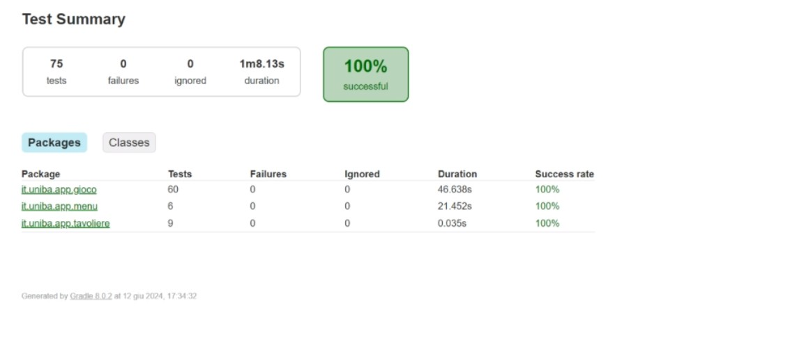


## 6.3 Descrizione dei test effettuati

In conformità con l'organizzazione standard della test suite, è stata creata una classe di test per ogni classe del software, tranne per le classi Boundary, poiché è stato seguito il principio della separazione della presentazione, e Utility, poiché non contengono metodi da testare.

--------------------------------------------------------------------------------------------------------

**MOSSA BASE**

Descrizione dei Casi di Test:

1.	<u>**Test per coordinateToNotazioneAlgebrica:**</u>
 - Verifica che il metodo converta correttamente le coordinate del tavoliere in notazione algebrica.

 - Esempi di conversioni testate: (0, 0) -> "a1", (1, 1) -> "b2", (6, 6) -> "g7".

2.	<u>**Test per catturaPedineAdiacenti:**</u>
 - Verifica che il metodo catturi correttamente le pedine avversarie adiacenti alla posizione di arrivo.
 - Posiziona manualmente pedine avversarie attorno alla posizione di arrivo.
 - Esegue il metodo catturaPedineAdiacenti con un setup specifico e verifica che le pedine avversarie siano convertite correttamente.

--------------------------------------------------------------------------------------------------------

**ADIACENTE**

Descrizione dei Casi di Test:

<U>**1.	Test per isMossaValida con posizione valida:**</u>
 - Verifica che una mossa valida ritorni true.

<u>**2.	Test per isMossaValida con posizione non valida:**</u>
 -  Verifica che una mossa non valida ritorni false.

<u>**3.	Test per eseguiMossa con posizione valida:**</u>
 -	Verifica che una mossa valida venga eseguita correttamente e ritorni true.

<u>**4.	Test per eseguiMossa con posizione non valida:**</u>
 -	Verifica che una mossa non valida non venga eseguita e ritorni false.

<u>**5.	Test per logMossa:**</u>
 -	Verifica che una mossa eseguita venga correttamente registrata nel log.

<u>**6.	Test per notazioneAlgebricaToCoord con posizione valida:**</u>
 -	Verifica che una notazione algebrica valida venga correttamente convertita in coordinate.

<u>**7.	Test per notazioneAlgebricaToCoord con posizione non valida:**</u>
 -	Verifica che una notazione algebrica non valida ritorni null.

--------------------------------------------------------------------------------------------------------

**EXIT**

Descrizione del Caso di Test:

- <u>**1.	Test per exitGame:**</u>
- Verifica che il metodo exitGame chiami ExitHandler.exitGame.

Note:
-	**ExitHandler** è un wrapper per System.exit e può essere sostituito durante i test.
-	Durante il test, **ExitHandler** viene sostituito con una versione di test (TestExitHandler) che permette di verificare se exitGame è stato chiamato.
-	Dopo il test, ExitHandler originale può essere ripristinato se necessario

--------------------------------------------------------------------------------------------------------

### **GAME**
Descrizione del Test

<u>**1.	Test del Costruttore:**</u>
 -	Verifica che gli attributi del Game siano inizializzati correttamente.

<u>**2.	Test di visualizzaTavoliereIniziale:**</u>
 -	Assicura che il metodo stampaTavoliere del tavoliere venga chiamato correttamente.

<u>**3.	Test di notazioneAlgebricaToCoord:**</u>
 - Verifica la corretta conversione della notazione algebrica in coordinate del tavoliere.
 - Controlla anche i casi in cui la notazione è fuori dal range.

<u>**4.	Test di getElapsedTime:**</u>
 -	Verifica che il metodo restituisca il tempo trascorso in formato hh:mm:ss.

<u>**5.	Test di determinareVincitore:**</u>
 -	Verifica che il metodo determini correttamente il vincitore in base al conteggio delle pedine.

<u>**6.	Test di logMossa e visualizzaStoricoMosse:**</u>
 -	Verifica che le mosse siano registrate correttamente e che il log delle mosse venga visualizzato correttamente.

Questi test coprono una parte significativa delle funzionalità della classe Game e possono essere eseguiti utilizzando JUnit senza la necessità di Mockito.

--------------------------------------------------------------------------------------------------------

### **SPOSTAMENTO**

**Note**

-	<u>**Setup:**</u> Assicura che il setup iniziale (setUp()) sia corretto per i test.

-	<u>**Test Valid Move:**</u> Verifica che le mosse valide siano identificate correttamente.

-	<u>**Test Invalid Move:**</u> Verifica che le mosse non valide siano identificate correttamente.

-	<u>**Test Execute Move:**</u> Verifica che una mossa valida venga eseguita correttamente.

-	<u>**Test Execute Invalid Move:**</u> Verifica che una mossa non valida non venga eseguita.

-	<u>**Test Log Move:**</u> Verifica che il log delle mosse venga aggiornato correttamente.

--------------------------------------------------------------------------------------------------------

### **QUIT**

Questi test verificano il comportamento della classe Quit per i seguenti scenari:

<u>**1.	Conferma abbandono con risposta "si":**</u> Verifica che il metodo confermaAbbandono restituisca true quando l'input dell'utente è "si".

<u>**2.	Conferma abbandono con risposta "no":**</u> Verifica che il metodo confermaAbbandono restituisca false quando l'input dell'utente è "no".

<u>**3.	Verifica lo stato di partita terminata:**</u> Verifica che il metodo getPartitaTerminata restituisca il valore corretto passato come parametro.

--------------------------------------------------------------------------------------------------------

### **HELP**

**Note**

- <u>**Setup and Teardown:**</u> I metodi setUpStreams() e restoreStreams() configurano e ripristinano gli stream di input e output per intercettare e verificare l'output.

- <u>**Test for Commands:**</u> Il metodo testMenuHelpComandi verifica che i comandi vengano visualizzati correttamente.

- <u>**Test for Rules:**</u> Il metodo testMenuHelpRegole verifica che le regole vengano visualizzate correttamente.

- <u>**Test for Exit:**</u> Il metodo testMenuHelpUscire verifica che l'uscita dal menu help funzioni correttamente.

Questi test coprono le funzionalità principali della classe Help, assicurando che le opzioni del menu siano gestite correttamente e che le rispettive informazioni siano visualizzate come previsto.

--------------------------------------------------------------------------------------------------------

### **MENU**

**Note**

-	<u>**Setup and Teardown:**</u> I metodi setUpStreams() e restoreStreams() configurano e ripristinano gli stream di output per intercettare e verificare l'output della console.

- <u>**Test for /gioca Command:**</u> Il metodo testMostraMenuPartitaGioca verifica che il comando /gioca inizia correttamente il gioco.

-	<u>**Test for /help Command:**</u> Il metodo testMostraMenuPartitaHelp verifica che il comando /help visualizzi correttamente il menu di aiuto.

-	<u>**Test for /vuoto Command:**</u> Il metodo testMostraMenuPartitaVuoto verifica che il comando /vuoto visualizzi correttamente il tavoliere vuoto.

-	<u>**Test for /tavoliere Command:**</u> Il metodo testMostraMenuPartitaTavoliere verifica che il comando /tavoliere visualizzi correttamente il tavoliere iniziale.

-	<u>**Test for /esci Command:**</u> Il metodo testMostraMenuPartitaEsci verifica che il comando /esci termini correttamente il gioco.

-	<u>**Test for Setting partitaTerminata:**</u> Il metodo testSetPartitaTerminata verifica che il metodo setPartitaTerminata imposti correttamente il valore di partitaterminata. Utilizza la riflessione per accedere al campo privato.

--------------------------------------------------------------------------------------------------------

### **TAVOLIERE**

**Note**

-	<u>**Setup:**</u> Il metodo setUp() inizializza un'istanza della classe Tavoliere prima di ogni test.

-	<u>**Test for inizializzaTavoliere():**</u> Verifica che il tavoliere venga inizializzato correttamente con le pedine nelle posizioni iniziali.

-	<u>**Test for getDimensione():**</u> Verifica che la dimensione del tavoliere sia corretta.

-	<u>**Test for isCasellaLibera():**</u> Verifica che una casella specifica sia libera.

-	<u>**Test for bloccaCasella():**</u> Verifica che una casella possa essere bloccata correttamente.

-	<u>**Test for notazioneAlgebricaToCoord():**</u> Verifica che la conversione da notazione algebrica a coordinate funzioni correttamente.

-	<u>**Test for posizionaPedina():**</u> Verifica che una pedina possa essere posizionata correttamente in una casella.

-	<u>**Test for rimuoviPedina():**</u> Verifica che una pedina possa essere rimossa correttamente da una casella.

-	<u>**Test for aggiornaStato():**</u> Verifica che il metodo aggiornaStato() possa essere eseguito senza eccezioni.

-	<u>**Test for getPedina():**</u> Verifica che il metodo getPedina() ritorni la pedina corretta in una casella specifica.

Questi test coprono le funzionalità principali della classe Tavoliere, assicurando che le operazioni sulle caselle del tavoliere vengano eseguite correttamente.

--------------------------------------------------------------------------------------------------------

### **TAVOLIEREVUOTO**

**Note:**

-	<u>**Setup:**</u> Il metodo setUp() inizializza un'istanza della classe TavoliereVuoto prima di ogni test.


# 7. MANUALE UTENTE 

 ### Indice
- 7.1 [Passi Preliminari](#71-passi-preliminari)
   - 7.1.1 [Installazione e configurazione di Docker](#711-installazzione-e-configurazione-di-docker)
   - 7.1.2 [Autenticazione con GitGub](#712-autenticazione-con-github)
- 7.2 [Avvio dell'applicazione](#72-avvio-dellapplicazione)
   - 7.2.1 [Guida ai comandi](#721-guida-ai-comandi)
   - 7.2.2 [Come si gioca](#722-come-si-gioca)
   - 7.2.3 [Glossario e termini chiave](#723-glossario-e-termini-chiave)

   ### Obiettivo del manuale
   Lo scopo di questo manuale è offrirti indicazioni precise e dettagliate sull'utilizzo di tutte le funzionalità di Ataxx. Grazie a istruzioni passo dopo passo, esempi concreti e consigli pratici, ci auguriamo di rendere l'esperienza di utilizzo del software piacevole e priva di difficoltà.

   ### 7.1 Passi preliminari:

   Di seguito sono riportate le operazioni per il corretto funzionamento di tutto il gioco:
    
    ### 7.1.1 Installazione e configurazione di Docker
   - Scaricare e installare [**Docker Desktop**](https://www.docker.com/products/docker-desktop) dal sito ufficiale 
   - Assicurarsi che l'installazione sia andata a buon fine
    - Avviare il programma **con privilegi elevati**
    - Utilizzare un prompt dei comandi e digitare il seguente comando: ``` docker info ```
   
    ### 7.1.2 Autenticazione con Github
   Accedi a Docker utilizzando un account GitHub per ottenere l'applicazione, dovrai generare un Personal Access Token di GitHub per collegare l'account.(se non sai creare un Token di GitHub clicca [qui](https://docs.github.com/en/enterprise-server@3.9/authentication/keeping-your-account-and-data-secure/managing-your-personal-access-tokens))
    - Una volta che sei riuscito a generare il Token salvalo su un file rinominato **Token.txt**;
    - Andare su un terminale e portandosi nella cartella dove è stato salvato il file precedentemente e scrivi questo comando:
    
    ```bash
   cat ./TOKEN.txt | docker login ghcr.io -u <USERNAME> --password-stdin
    ``` 
   
**ATTENZIONE**  Ricorda di sostituire <USERNAME> con il proprio username di GitHub
    
   ## 7.2 Avvio dell'applicazione 
   Per eseguire l'applicazione è importante avere l'app **Docker Desktop** aperta sul proprio pc e eseguire sul terminale il comando

   ```bash
   docker pull ghcr.io/softeng2324-inf-uniba/ataxx-brooks:latest 
   ```
   Mentre per avviare il programma , digita il seguente comando:
   ```bash
   winpty docker run --rm -it ghcr.io/softeng2324-inf-uniba/ataxx-brooks:latest
   ```
   ### 7.2.1 Guida ai comandi
   Qui sono riportati tutti i comandi che si possono digitare durante l'esecuzione del gioco inoltre in caso di problemi è possibile visionare i comandi nel menù `/help`, `--h` o `-h`.
   #### Comandi
   - [/gioca:](#user-story-1-come-giocatore-voglio--iniziare-una-nuova-partita-01) Questo comando avvia una nuova partita da zero, resettando il tabellone e reimpostando lo stato del gioco.
   - [/abbandona:](#user-story-6-come-giocatore-voglio--abbandonare-la-partita-06) Termina la partita attuale e consente di iniziare una nuova partita
   - [/vuoto:](#user-story-3-come-giocatore-voglio--mostrare-il-tavoliere-vuoto-con-la-numerazione-03) Visualizza il tavoliere vuoto.
   - [/qualimosse:](#user-story-5-come-giocatore-voglio--visualizzare-le-mosse-possibili-di-una-pedina-05) Visualizza le mosse possibili di un giocatore
   - [/tavoliere:](#user-story-4-come-giocatore-voglio--mostrare-il-tavoliere-con-le-pedine-e-la-numerazione-04) Visualizza il tavoliere con le pedine posizionate.
   - [/help:](#user-story-2-come-giocatore-voglio--mostrare-lhelp-con-elenco-comandi-02) Mostra i comandi utili per il Gioco
   - [/esci:](#user-story-7-come-giocatore-voglio--chiudere-il-gioco-07) Termina il programma.
   - [/mosse](#user-story-11-come-giocatore-voglio--mostrare-le-mosse-giocate-11) Mostra la cronologia delle mosse con notazione algebrica.
   - [/tempo](#user-story-14-come-giocatore-voglio--mostrare-il-tempo-di-gioco-14) Mostra il tempo trascorso dall'inizio della partita nel formato ore:minuti:secondi.
   - [/blocca xn](#user-story-15-come-giocatore-voglio--impostare-caselle-non-accessibili-15) Imposta la casella di coordinate xn come non accessibile.
   
   ### 7.2.2 Come si gioca
     
   Una volta avviata l'applicazione, verrà visualizzata la scritta *Ataxx* sotto al quale verrà suggerito di digitare il comando `/help`, `--h` o `-h` per visualizzare i comandi disponibili.

   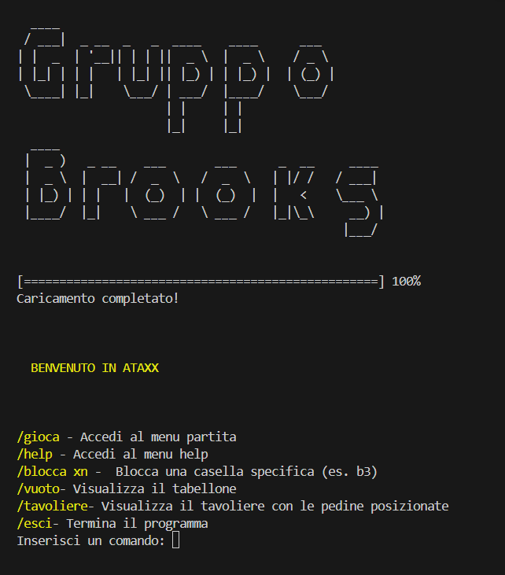

Nel menu sarà possibile iniziare una nuova partita digitando il comando `/gioca`, oppure si potrà chiudere il gioco digitando `/esci`.


L'utente se vuole può decidere di visualizzare il tavoliere vuoto senza le pedine, digitando il comando `/vuoto`.


Prima dell'inizio del gioco, il giocatore può scegliere di bloccare alcune celle della griglia utilizzando il comando /blocca xn, dove xn rappresenta la coordinata della cella. Non è consentito bloccare le celle di partenza del gioco, le celle adiacenti a una cella di partenza, o le celle a una distanza di 2 da una cella di partenza. Inoltre, non si possono bloccare più di 9 celle in totale. Si può bloccare una sola cella per volta, quindi per bloccare più celle, sarà necessario ripetere il comando ogni volta.


A questo punto sarà possibile visualizzare le mosse disponibili digitando il comando `/qualimosse`. Verrà richiesto di inserire le coordinate della riga e della colonna di dove si vuole spostare la pedina.


Dopo aver effettuato delle mosse, l'utente, potrà visualizzare lo storico delle mosse effettuate digitando il comando `/mosse`.

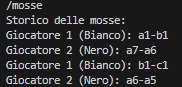

L'utente potrà anche visualizzare il tempo effettivo di gioco digitando il comando `/tempo`, in questo modo verrà visualizzato il tempo nel formato *ore:minuti:secondi*.


In seguito, il giocatore avrà la possibilità di proseguire con le mosse oppure di lasciare la partita utilizzando il comando `/abbandona`, dichiarando così la propria sconfitta (verrà visualizzato il numero di pedine dell'avversario rispetto alle zero pedine di chi ha abbandonato). Se il giocatore inserisce il comando per abbandonare, sarà chiesto di confermare con il comando *si* oppure di tornare alla partita digitando *no*.

Se il gioco si conclude non per rinuncia, ma perché il tavoliere è stato completamente occupato, verrà mostrato il vincitore con il conteggio delle pedine rimanenti per ciascun giocatore. Vince chi possiede il maggior numero di pedine.

Può succedere che un giocatore catturi tutte le pedine dell'avversario. In questo caso, il turno proseguirà fino alla fine del gioco per il giocatore che ha ancora pedine sul tavoliere.

   ### 7.2.3 Glossario e termini chiave
   All'interno dell'app vengono utilizzati alcuni termini che potrebbero causare incomprensioni. Ecco una spiegazione di alcuni di essi:
      - **Tavoliere:** Il tavoliere è l'area di gioco, composto da 49 caselle (7x7), sulle quali verranno mosse le pedine.
      - **Pedine:** Le pedine sono gli elementi principali del gioco. Possono essere nere o bianche e possono eseguire mosse specifiche, descritte nella sezione "Come si Gioca".

## 8. PROCESSO DI SVILUPPO E ORGANIZZAZIONE DEL LAVORO
   ### 8.1 Introduzione Processo di Sviluppo
Il processo di sviluppo e l'organizzazione del lavoro all'interno del gruppo Brooks hanno svolto un ruolo fondamentale nel raggiungimento degli obiettivi prefissati.

La sinergia e il supporto reciproco tra i membri del team, uniti a una comunicazione aperta e trasparente, hanno permesso di superare gli ostacoli e rispettare le scadenze.

Nel corso dell'intera fase di realizzazione del progetto, la squadra ha utilizzato l'approccio dello sviluppo software Agile. L'Agile prevede una fase preliminare di raccolta dei requisiti, seguita da continui perfezionamenti e aggiornamenti del prodotto software effettuati dai membri del team di sviluppo.
   
   ### 8.2 Roadmap degli sprint 

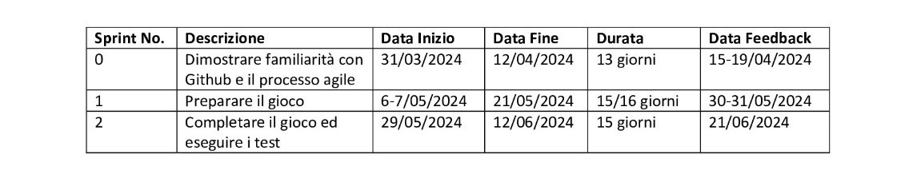

   ### 8.3 Gestione degli sprint
Dato l'utilizzo del framework Scrum, gli Sprint si compongono di varie fasi principali: analisi, implementazione e testing.

In generale sono state seguite queste regole:

Le issue riguardanti la documentazione sono state svolte da tutti i componenti, con maggior carico **Paolo Giampietro e Andrea Di Caro.**

Le issue riguardanti il codice sono state svolte da tutti, le parti più complesse sono state assegnate ad **Alessandro De Benedictis e Claudio De Benedictis.**

I grafici che vedete nel report sono stati realizzati da **Francesco Gassi**

Le restanti issue sono state divise tra i 5 componenti.

   #### 8.3.1 Sprint 0

Lo Sprint Goal era quello di mostrare familiarità con Git, [Github](https://github.com/) e il processo Agile.

   - <u> Analisi:</u> per prima cosa abbiamo diviso i compiti tra i vari membri del team. In questo Sprint, i task riguardavano la documentazione in modo da permettere ai componenti del team di prendere confidenza con gli strumenti e i processi senza aggiungere complicazioni dovute al codice.

   - <u> Implementazione:</u> ognuno ha eseguito i propri task: aggiornare i file con l’assegnazione dell’anno corrente, personalizzare le immagini nella [Guida per lo studente](Guida%20per%20lo%20studente.md), creare il [CODE_OF_CONDUCT](CODE_OF_CONDUCT.md), inserendo il codice di comportamento del gruppo e il file [Ispiratore](ISPIRATORE.md) con la biografia e i principali contributi del personaggio da cui il gruppo prende il nome.
  
   - <u>Testing:</u> revisione di tali documenti per correggere eventuali errori sfuggiti

   #### 8.3.2 Sprint 1

   Lo Sprint Goal era quello di preparare il gioco.

   - <u> Analisi:</u> abbiamo diviso i compiti tra i vari membri del team, in modo da garantire una suddivisione il più possibile equa della mole di lavoro prevista.

   - <u>Implementazione:</u> ogni assigner ha lavorato individualmente, coordinandosi con gli altri componenti del team per limitare il più possibile eventuali Merge Conflicts.

   - <u>Testing:</u> il codice è stato testato in maniera sincrona sul nostro server [Discord](https://discord.com/), abbiamo avviato l'applicazione per testare tutti i possibili input, per assicurarne la robustezza.

   #### 8.3.3 Sprint 2

Lo Sprint Goal era quello di completare il gioco, assicurandone la sua qualità.

   - <u>Analisi:</u> assegnati i compiti ai vari membri del team per assicurare una distribuzione quanto più equa possibile  del carico di lavoro previsto.

   - <u>Implementazione:</u> ogni membro ha iniziato a lavorare alle proprie User Story, mantenendosi sempre in contatto con gli altri membri del team.

   Sono stati sviluppati il **diagramma dei package**, relativo al System Design, insieme ai **diagrammi delle classi** e i **diagrammi di sequenza**

   - <u>Testing:</u> infine la fase di testing è stata effettuata da Claudio De Benedictis e Alessandro De Benedictis

P.S Nel corso dell'esecuzione da parte di Claudio De Benedictis c'erano dei test che non funzionavano, quindi gradle restituiva errore in seguito i test sono stati passati ad Alessandro De Benedictis e corretti.

   ### 8.4 Software utilizzati
- **Organizzazione e Review del lavoro**
    - [*Microsoft Teams*](https://www.microsoft.com/en-us/microsoft-teams/group-chat-software), in cui venivano definiti i compiti per ogni Sprint;
    - [*Discord*](https://discord.com/), per le riunioni interne al team;
    - [*Whatsapp*](https://www.whatsapp.com/), per organizzare le riunioni sincrone.
- **Ambienti di sviluppo**
    - [*Visual Studio Code*](https://code.visualstudio.com/), IDE utilizzato per lo sviluppo del codice in Java e anche come text editor per il MarkDown.
        - *Plugin aggiuntivi*
            - [*CheckStyle IDEA*](https://plugins.jetbrains.com/plugin/1065-checkstyle-idea), per controllare eventuali problemi di CheckStyle evitando così di eseguire sempre il comando `./gradlew build`;
            - [*Gradle*](https://gradle.org/), utilizzato per l'esecuzione del programma all'interno d'IntellJ
- **Software per la creazione di diagrammi**
    - [*StarUML*](https://staruml.io/)
    - [*Draw.io*](https://app.diagrams.net/)
   
   
   ### 8.5 Comunicazione interna al team
In questa immagine si può osservare come Discord sia stato di grande aiuto per portare a termine il lavoro, grazie ai canali vocali, testuali e alla funzione di condivisione dello schermo.

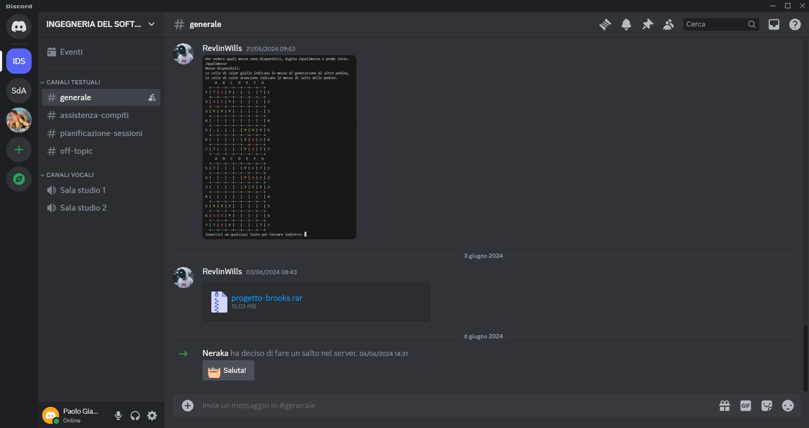


### 9. ANALISI RETROSPETTIVA
L'analisi retrospettiva è fondamentale per valutare i progressi compiuti durante gli sprint
precedenti e identificare eventuali aree di miglioramento. In particolare, viene analizzato lo
Sprint 0 e lo Sprint 1 con una valutazione dei progressi raggiunti, dei problemi riscontrati e delle soluzioni
adottate.

   #### 9.1 SPRINT 0
   Abbiamo concluso con successo lo Sprint 0, raggiungendo tutti gli obiettivi prefissati.
   Questo è un traguardo significativo per il nostro team e un chiaro indicatore del nostro impegno e della nostra dedizione.

   Il raggiungimento di questo risultato non sarebbe stato possibile senza la sinergia e il supporto reciproco di tutti i membri del team. Ogni individuo ha contribuito con le proprie competenze e conoscenze, permettendo al team di superare rapidamente gli ostacoli che si sono presentati lungo il percorso. Questo spirito di collaborazione e mutualità ha permesso di rispettare tutte le scadenze, nonostante le sfide incontrate.

   Un altro fattore chiave del nostro successo è stata la comunicazione aperta e trasparente all’interno del team. Questo ha permesso a tutti di essere costantemente informati sullo stato del progetto e di sentirsi coinvolti in ogni decisione. Questa comunicazione efficace ha migliorato notevolmente la nostra efficienza, riducendo i malintesi e assicurando che tutti fossero sulla stessa lunghezza d’onda.

   In conclusione, la nostra capacità di lavorare insieme come un team unito, superando gli ostacoli e mantenendo una comunicazione aperta, ha facilitato il raggiungimento degli obiettivi dello Sprint 0. Continueremo a lavorare con lo stesso spirito di collaborazione e determinazione per raggiungere gli obiettivi nei prossimi sprint.
   
   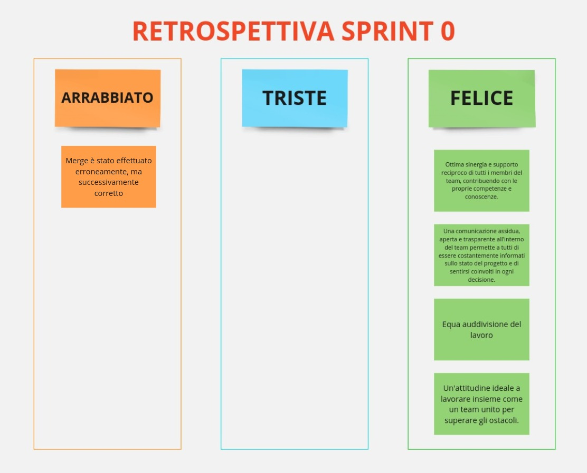

   #### 9.2 SPRINT 1
   Abbiamo valutato in modo approfondito il nostro lavoro, riconoscendo sia le realizzazioni che le aree in cui possiamo migliorare.

   Ci riteniamo soddisfatti di aver sviluppato nel modo corretto la maggior parte delle funzionalità richieste, ma sconsolati da una piccola mancanza di comunicazione che ha prodotto conseguenze significative che hanno compromesso lo sviluppo corretto del lavoro.

   Tale mancanza ha influenzato negativamente il morale del team.
   
   **Azione correttiva da intraprendere:**
   Migliorare la comunicazione favorendo la trasparenza con un ambiente di lavoro aperto e inclusivo.
   
   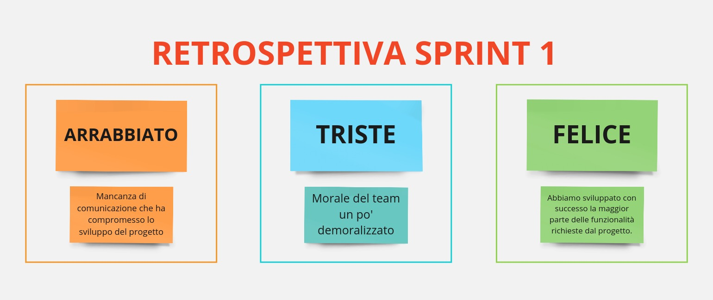